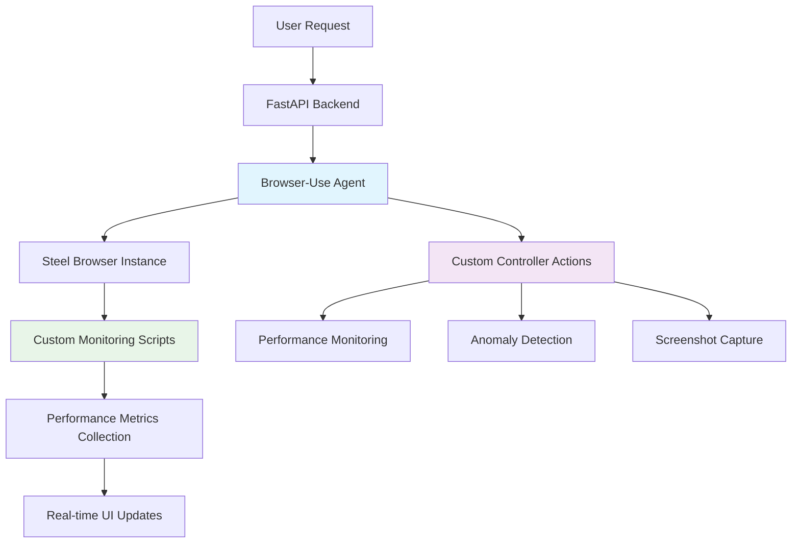
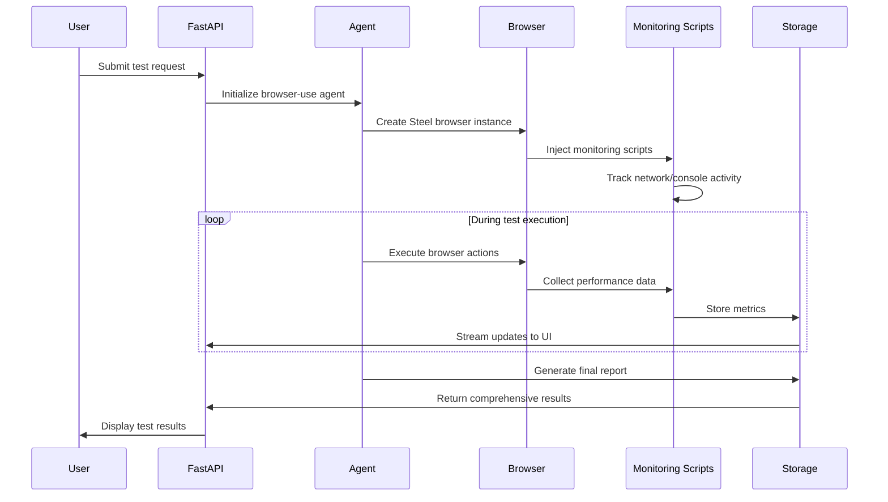

# Browser-Use Integration and Custom Functions

## Overview

Bugzer Browser leverages the `browser-use` library as its core automation engine, enhanced with custom functions and monitoring capabilities. This document details how we integrate browser-use, the custom functions we've built, and the performance monitoring system.

## Architecture Overview



## Browser-Use Integration

### Core Integration Points

The browser-use integration is implemented in `api/plugins/browser_use/agent.py`:

```python
# Key integration components
class SessionAwareController(Controller):
    """Custom controller with session management"""
    
agent = Agent(
    llm=llm,
    task=history[-1]["content"],
    controller=controller,
    browser=browser,
    browser_context=browser_context,
    generate_gif=False,
    use_vision=use_vision,
    register_new_step_callback=yield_data,
    register_done_callback=yield_done,
    system_prompt_class=ExtendedSystemPrompt,
)
```

### Steel Browser Integration

We use Steel Browser for remote browser automation:

```python
browser = Browser(
    BrowserConfig(
        cdp_url=f"{STEEL_CONNECT_URL}?apiKey={STEEL_API_KEY}&sessionId={session_id}"
    )
)
```

## Custom Functions and Actions

### 1. Performance Monitoring Functions

#### `capture_performance_metrics()`
Captures comprehensive page performance data:

```python
@controller.action('Capture page performance metrics')
async def capture_performance_metrics() -> str:
    """Captures detailed performance metrics from the current page"""
```

**What it captures:**
- Page load timing (DNS, TCP, server response)
- Resource loading statistics
- Performance timing API data
- Connection metrics
- Resource size analysis

#### `capture_network_requests()`
Monitors all network activity:

```python
@controller.action('Capture network requests')
async def capture_network_requests() -> str:
    """Captures all network requests made by the page"""
```

**Network monitoring includes:**
- XHR requests
- Fetch API calls
- Resource loading (images, scripts, stylesheets)
- Request/response timing
- Error tracking

#### `detect_page_anomalies()`
Identifies potential issues on the page:

```python
@controller.action('Detect page anomalies')
async def detect_page_anomalies() -> str:
    """Detects various types of page anomalies"""
```

**Anomaly detection covers:**
- Console errors
- Layout issues (offscreen elements)
- Network performance problems
- Accessibility issues
- JavaScript errors
- Screenshot capture for visual inspection

#### `get_real_time_network_activity()`
Provides real-time network monitoring:

```python
@controller.action('Get real-time network activity')
async def get_real_time_network_activity() -> str:
    """Gets current network activity statistics"""
```

### 2. Custom System Prompt

Our `ExtendedSystemPrompt` class adds safety protocols and monitoring capabilities:

```python
class ExtendedSystemPrompt(SystemPrompt):
    """Custom system prompt with safety protocols and monitoring tools"""
```

**Key features:**
- Mandatory confirmation protocols
- Safety checks for financial decisions
- Performance monitoring tool access
- Getting unstuck protocols
- UI visibility requirements

## JavaScript Injection System

### Monitoring Script Injection

We inject comprehensive monitoring scripts into every page:

```javascript
// Core monitoring namespace
window.__BROWSER_USE_MONITOR = {
    networkRequests: [],
    networkErrors: [],
    consoleErrors: [],
    initialized: false
};
```

### XHR Request Monitoring

```javascript
// Override XMLHttpRequest to track requests
const originalXhrOpen = XMLHttpRequest.prototype.open;
const originalXhrSend = XMLHttpRequest.prototype.send;

XMLHttpRequest.prototype.open = function(method, url) {
    this.__requestData = { 
        method, 
        url, 
        type: 'xhr', 
        startTime: performance.now(), 
        status: 'pending' 
    };
    window.__BROWSER_USE_MONITOR.networkRequests.push(this.__requestData);
    return originalXhrOpen.apply(this, arguments);
};
```

### Fetch API Monitoring

```javascript
// Override fetch to track requests
const originalFetch = window.fetch;
window.fetch = function(resource, init) {
    const requestData = { 
        method: init?.method || 'GET', 
        url: typeof resource === 'string' ? resource : resource.url, 
        type: 'fetch', 
        startTime: performance.now(), 
        status: 'pending' 
    };
    
    window.__BROWSER_USE_MONITOR.networkRequests.push(requestData);
    
    return originalFetch.apply(this, arguments)
        .then(response => {
            requestData.status = response.status;
            requestData.duration = performance.now() - requestData.startTime;
            return response;
        });
};
```

### Console Error Tracking

```javascript
// Track console errors
window.addEventListener('error', (e) => {
    window.__BROWSER_USE_MONITOR.consoleErrors.push(
        `${e.message} at ${e.filename}:${e.lineno}`
    );
});

// Override console.error
const originalConsoleError = console.error;
console.error = function() {
    window.__BROWSER_USE_MONITOR.consoleErrors.push(
        Array.from(arguments).join(' ')
    );
    originalConsoleError.apply(console, arguments);
};
```

## Session Management

### Session-Aware Controller

Our custom controller manages browser sessions:

```python
class SessionAwareController(Controller):
    def set_session_id(self, session_id: str):
        """Sets session ID and initializes storage"""
        self.session_id = session_id
        session_metrics_storage[session_id]  # Initialize via defaultdict
        self.finished = False
```

### Metrics Storage

```python
# Global session storage
session_metrics_storage: Dict[str, Dict[str, Dict[str, Any]]] = defaultdict(
    lambda: {"pages": {}}
)

def _store_metric(self, page_url: str, metric_type: str, data: Any):
    """Stores metrics for a specific page in the session"""
    session_data = self._get_current_session_metrics()
    if page_url not in session_data["pages"]:
        session_data["pages"][page_url] = {}
    session_data["pages"][page_url][metric_type] = data
```

## Browser Context Management

### Multi-Page Support

```python
async def setup_browser_monitoring_hooks(browser_context: BrowserContext):
    """Setup event listeners for monitoring page navigation"""
    
    # Handle new pages
    async def _on_new_page(page):
        await _inject_for_page(page)
        page.on("load", lambda _: asyncio.create_task(_inject_for_page(page)))
    
    # Attach listener for future pages
    playwright_context.on("page", lambda page: asyncio.create_task(_on_new_page(page)))
```

### Page Injection Process

```python
async def inject_monitoring_scripts(page):
    """Injects JavaScript into the page to track network requests and console errors"""
    try:
        await page.evaluate("""() => {
            // Injection logic here
        }""")
        logger.info("Successfully injected monitoring scripts")
    except Exception as e:
        logger.error(f"Failed to inject monitoring scripts: {e}")
```

## Data Flow Architecture



## Custom Action Registration

### Action Decorator Pattern

```python
@controller.action('Action Name')
async def custom_action() -> str:
    """Action description"""
    # Implementation
    return result
```

### Available Custom Actions

1. **Performance Actions:**
   - `capture_performance_metrics()`
   - `capture_network_requests()`
   - `detect_page_anomalies()`
   - `get_real_time_network_activity()`

2. **Utility Actions:**
   - `show_performance_metrics()`
   - `generate_performance_report()`

## Error Handling and Resilience

### Browser Cleanup

```python
# Clean up browser resources
if session_id in active_browsers:
    try:
        browser = active_browsers[session_id]
        await browser.close()
        del active_browsers[session_id]
        logger.info(f"Closed browser for session: {session_id}")
    except Exception as e:
        logger.error(f"Error closing browser: {str(e)}")
```

### Session State Management

```python
# Mark session as completed
controller.finished = True
logger.info(f"Session {session_id} marked as completed")
```

## Integration with UI

### Real-time Updates

The browser-use agent streams data to the UI through callbacks:

```python
def yield_data(browser_state, agent_output, step_number):
    """Callback function for each step"""
    # Format Memory
    if agent_output.current_state.memory:
        message = AIMessage(content=f"*Memory*:\n{agent_output.current_state.memory}")
        asyncio.get_event_loop().call_soon_threadsafe(queue.put_nowait, message)
    
    # Format Next Goal
    if agent_output.current_state.next_goal:
        message = AIMessage(content=f"*Next Goal*:\n{agent_output.current_state.next_goal}")
        asyncio.get_event_loop().call_soon_threadsafe(queue.put_nowait, message)
```

### Tool Call Formatting

```python
# Format tool calls for UI display
for action_model in agent_output.action:
    if hasattr(action_model, 'action') and action_model.action:
        tool_calls.append({
            "toolCallId": f"action_{step_number}_{len(tool_calls)}",
            "toolName": action_model.action,
            "args": action_model.args
        })
```

## Performance Considerations

### Memory Management

- Session-based metric storage with automatic cleanup
- Efficient data structures for real-time monitoring
- Lazy loading of browser resources

### Network Optimization

- Minimal JavaScript injection overhead
- Efficient request tracking without blocking
- Compressed metric storage

### Scalability

- Session isolation prevents cross-contamination
- Browser instance reuse for multiple tests
- Asynchronous processing for all operations

## Security Considerations

### Safety Protocols

Our custom system prompt enforces strict safety protocols:

- Mandatory confirmation for search results
- Required approval for link clicks
- Financial decision safeguards
- Technical obstacle handling

### Data Privacy

- Session-based data isolation
- No persistent storage of sensitive data
- Secure browser context management

## Future Enhancements

### Planned Features

1. **Advanced Anomaly Detection:**
   - Machine learning-based issue detection
   - Pattern recognition for common problems
   - Automated issue categorization

2. **Enhanced Monitoring:**
   - Real-time performance dashboards
   - Historical trend analysis
   - Custom metric definitions

3. **Browser Compatibility:**
   - Multi-browser support
   - Mobile device testing
   - Cross-platform validation

This comprehensive integration of browser-use with custom monitoring functions provides a robust foundation for automated web testing and performance analysis.

