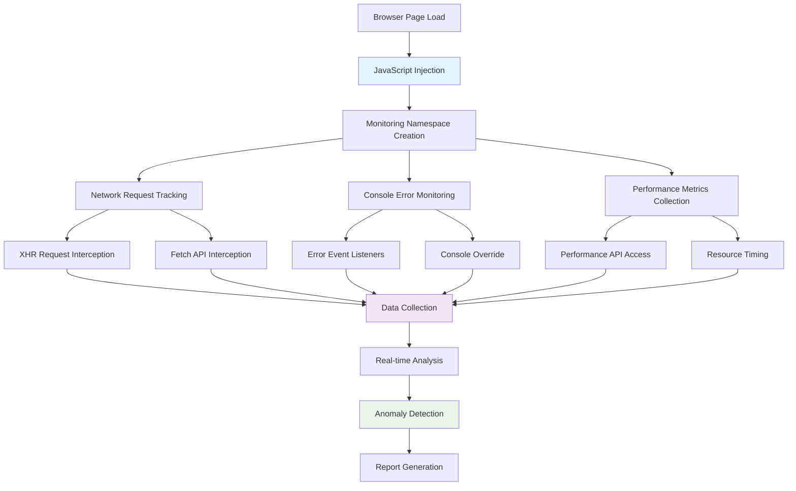
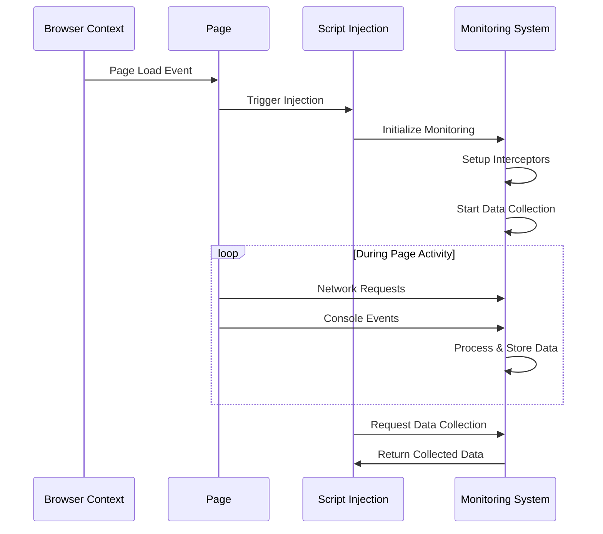
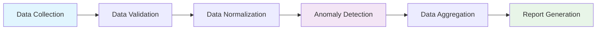
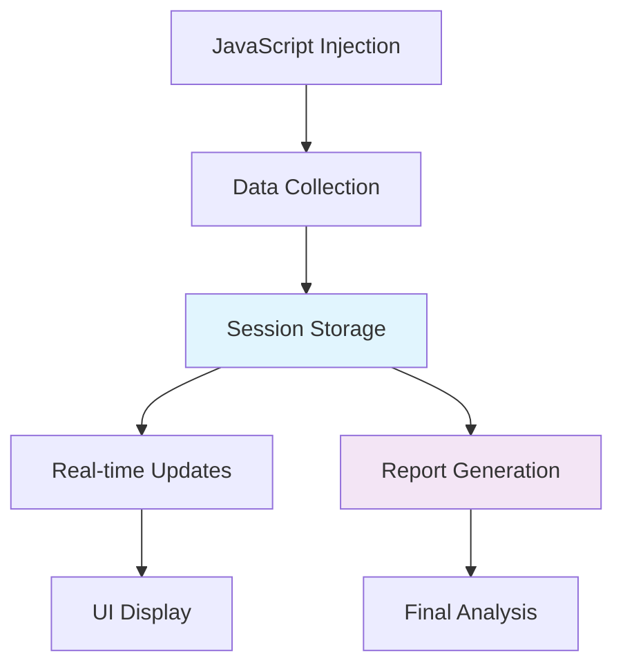

# JavaScript Injection and Information Extraction

## Overview

Bugzer Browser uses sophisticated JavaScript injection techniques to extract comprehensive information from web pages during automated testing. This system monitors network activity, captures performance metrics, detects anomalies, and provides real-time insights into page behavior.

## Architecture Overview



## Core Injection System

### Initialization Process

The JavaScript injection system is initialized on every page load:

```javascript
// Core monitoring namespace
if (!window.__BROWSER_USE_MONITOR) {
    window.__BROWSER_USE_MONITOR = {
        networkRequests: [],
        networkErrors: [],
        consoleErrors: [],
        initialized: false
    };
    
    console.log('[browser-use] Initializing performance monitoring');
}
```

### Injection Lifecycle



## Network Request Monitoring

### XMLHttpRequest Interception

We intercept all XMLHttpRequest calls to track network activity:

```javascript
// Store original methods
const originalXhrOpen = XMLHttpRequest.prototype.open;
const originalXhrSend = XMLHttpRequest.prototype.send;

// Override open method
XMLHttpRequest.prototype.open = function(method, url) {
    this.__requestData = { 
        method, 
        url, 
        type: 'xhr', 
        startTime: performance.now(), 
        status: 'pending' 
    };
    window.__BROWSER_USE_MONITOR.networkRequests.push(this.__requestData);
    return originalXhrOpen.apply(this, arguments);
};

// Override send method
XMLHttpRequest.prototype.send = function() {
    if (this.__requestData) {
        const request = this.__requestData;
        
        // Track successful responses
        this.addEventListener('load', function() {
            request.status = this.status;
            request.duration = performance.now() - request.startTime;
            request.size = parseInt(this.getResponseHeader('Content-Length') || '0');
        });
        
        // Track errors
        this.addEventListener('error', function() {
            request.status = 'failed';
            request.duration = performance.now() - request.startTime;
            const errorMsg = `XHR failed: ${request.method} ${request.url}`;
            window.__BROWSER_USE_MONITOR.networkErrors.push(errorMsg);
        });
        
        // Track timeouts
        this.addEventListener('timeout', function() {
            request.status = 'timeout';
            request.duration = performance.now() - request.startTime;
            const errorMsg = `XHR timeout: ${request.method} ${request.url}`;
            window.__BROWSER_USE_MONITOR.networkErrors.push(errorMsg);
        });
    }
    return originalXhrSend.apply(this, arguments);
};
```

### Fetch API Interception

Modern applications often use the Fetch API, which we also intercept:

```javascript
// Store original fetch
const originalFetch = window.fetch;

// Override fetch
window.fetch = function(resource, init) {
    const url = typeof resource === 'string' ? resource : resource.url;
    const method = init?.method || (typeof resource === 'string' ? 'GET' : resource.method || 'GET');
    
    const requestData = { 
        method, 
        url, 
        type: 'fetch', 
        startTime: performance.now(), 
        status: 'pending' 
    };
    
    window.__BROWSER_USE_MONITOR.networkRequests.push(requestData);
    
    return originalFetch.apply(this, arguments)
        .then(response => {
            requestData.status = response.status;
            requestData.duration = performance.now() - requestData.startTime;
            
            // Track non-2xx responses as errors
            if (!response.ok) {
                const errorMsg = `Fetch error ${response.status}: ${method} ${url}`;
                window.__BROWSER_USE_MONITOR.networkErrors.push(errorMsg);
            }
            
            return response;
        })
        .catch(error => {
            requestData.status = 'failed';
            requestData.duration = performance.now() - requestData.startTime;
            
            const errorMsg = `Fetch failed: ${method} ${url} - ${error.message}`;
            window.__BROWSER_USE_MONITOR.networkErrors.push(errorMsg);
            
            throw error;
        });
};
```

## Console Error Monitoring

### Global Error Tracking

We capture all JavaScript errors that occur on the page:

```javascript
// Track global errors
window.addEventListener('error', (e) => {
    window.__BROWSER_USE_MONITOR.consoleErrors.push(
        `${e.message} at ${e.filename}:${e.lineno}`
    );
});

// Track unhandled promise rejections
window.addEventListener('unhandledrejection', (e) => {
    window.__BROWSER_USE_MONITOR.consoleErrors.push(
        `Unhandled Promise Rejection: ${e.reason}`
    );
});
```

### Console Method Override

We intercept console.error calls to capture application-level errors:

```javascript
// Override console.error
const originalConsoleError = console.error;
console.error = function() {
    window.__BROWSER_USE_MONITOR.consoleErrors.push(
        Array.from(arguments).join(' ')
    );
    originalConsoleError.apply(console, arguments);
};

// Override console.warn for additional context
const originalConsoleWarn = console.warn;
console.warn = function() {
    window.__BROWSER_USE_MONITOR.consoleErrors.push(
        `WARNING: ${Array.from(arguments).join(' ')}`
    );
    originalConsoleWarn.apply(console, arguments);
};
```

## Performance Metrics Collection

### Performance API Integration

We leverage the browser's Performance API to collect detailed metrics:

```javascript
// Collect performance timing data
function collectPerformanceMetrics() {
    const timing = performance.timing;
    const navigation = performance.getEntriesByType('navigation')[0];
    
    return {
        // Page load timing
        pageLoadTime: timing.loadEventEnd - timing.navigationStart,
        domContentLoaded: timing.domContentLoadedEventEnd - timing.navigationStart,
        firstPaint: navigation ? navigation.firstPaint : null,
        firstContentfulPaint: navigation ? navigation.firstContentfulPaint : null,
        
        // Connection timing
        dnsLookup: timing.domainLookupEnd - timing.domainLookupStart,
        tcpConnection: timing.connectEnd - timing.connectStart,
        serverResponse: timing.responseEnd - timing.requestStart,
        
        // Resource timing
        resourceCount: performance.getEntriesByType('resource').length,
        totalResourceSize: performance.getEntriesByType('resource')
            .reduce((total, resource) => total + (resource.transferSize || 0), 0)
    };
}
```

### Resource Analysis

We analyze all loaded resources for performance insights:

```javascript
// Analyze resource loading
function analyzeResources() {
    const resources = performance.getEntriesByType('resource');
    const analysis = {
        byType: {},
        slowest: [],
        largest: [],
        errors: []
    };
    
    resources.forEach(resource => {
        const type = resource.initiatorType || 'unknown';
        
        // Group by type
        if (!analysis.byType[type]) {
            analysis.byType[type] = {
                count: 0,
                totalSize: 0,
                totalDuration: 0
            };
        }
        
        analysis.byType[type].count++;
        analysis.byType[type].totalSize += resource.transferSize || 0;
        analysis.byType[type].totalDuration += resource.duration || 0;
        
        // Track slow resources (>2 seconds)
        if (resource.duration > 2000) {
            analysis.slowest.push({
                name: resource.name,
                duration: resource.duration,
                size: resource.transferSize
            });
        }
        
        // Track large resources (>1MB)
        if (resource.transferSize > 1024 * 1024) {
            analysis.largest.push({
                name: resource.name,
                size: resource.transferSize,
                duration: resource.duration
            });
        }
    });
    
    return analysis;
}
```

## Anomaly Detection System

### Layout Issue Detection

We detect common layout problems that could affect user experience:

```javascript
// Detect layout anomalies
function detectLayoutIssues() {
    const issues = [];
    const viewportWidth = window.innerWidth;
    const viewportHeight = window.innerHeight;
    
    // Check for offscreen interactive elements
    const interactiveElements = document.querySelectorAll(
        'button, a, input, select, textarea, [onclick], [role="button"]'
    );
    
    interactiveElements.forEach(el => {
        const rect = el.getBoundingClientRect();
        if (rect.width > 0 && rect.height > 0) {
            // Check if element is offscreen
            if (rect.right < 0 || rect.bottom < 0 || 
                rect.left > viewportWidth || rect.top > viewportHeight) {
                const text = el.textContent || el.value || el.id || 
                           el.className || el.tagName;
                issues.push({
                    type: 'offscreen_element',
                    element: text.trim().substring(0, 50),
                    position: { left: rect.left, top: rect.top }
                });
            }
        }
    });
    
    return issues;
}
```

### Accessibility Issue Detection

We identify common accessibility problems:

```javascript
// Detect accessibility issues
function detectAccessibilityIssues() {
    const issues = [];
    
    // Check for missing alt text on images
    const images = document.querySelectorAll('img');
    images.forEach(img => {
        if (!img.alt || img.alt === '') {
            issues.push({
                type: 'missing_alt_text',
                element: 'img',
                src: img.src,
                severity: 'medium'
            });
        }
    });
    
    // Check for form controls without labels
    const formControls = document.querySelectorAll('input, select, textarea');
    formControls.forEach(control => {
        const label = document.querySelector(`label[for="${control.id}"]`);
        if (!label && !control.getAttribute('aria-label')) {
            issues.push({
                type: 'missing_label',
                element: control.tagName,
                id: control.id || control.name || control.placeholder,
                severity: 'high'
            });
        }
    });
    
    // Check for missing heading structure
    const headings = document.querySelectorAll('h1, h2, h3, h4, h5, h6');
    if (headings.length === 0) {
        issues.push({
            type: 'missing_headings',
            severity: 'medium',
            description: 'No heading structure found'
        });
    }
    
    return issues;
}
```

## Data Extraction and Processing

### Comprehensive Data Collection

Our system collects data from multiple sources:

```javascript
// Main data collection function
function collectAllData() {
    return {
        // Network data
        networkRequests: window.__BROWSER_USE_MONITOR.networkRequests,
        networkErrors: window.__BROWSER_USE_MONITOR.networkErrors,
        
        // Console data
        consoleErrors: window.__BROWSER_USE_MONITOR.consoleErrors,
        
        // Performance data
        performanceMetrics: collectPerformanceMetrics(),
        resourceAnalysis: analyzeResources(),
        
        // Anomaly data
        layoutIssues: detectLayoutIssues(),
        accessibilityIssues: detectAccessibilityIssues(),
        
        // Page metadata
        pageInfo: {
            url: window.location.href,
            title: document.title,
            viewport: {
                width: window.innerWidth,
                height: window.innerHeight
            },
            userAgent: navigator.userAgent,
            timestamp: new Date().toISOString()
        }
    };
}
```

### Real-time Data Processing



## Screenshot and Visual Analysis

### Full-Page Screenshot Capture

We capture comprehensive screenshots for visual analysis:

```javascript
// Full-page screenshot with scrolling
async function captureFullPageScreenshot() {
    // Get full page dimensions
    const fullHeight = Math.max(
        document.body.scrollHeight,
        document.documentElement.scrollHeight,
        document.body.offsetHeight,
        document.documentElement.offsetHeight,
        document.body.clientHeight,
        document.documentElement.clientHeight
    );
    
    // Scroll down in increments to ensure all content is loaded
    const scrollStep = window.innerHeight / 2;
    let currentScroll = 0;
    
    // Start from top
    window.scrollTo(0, 0);
    await new Promise(r => setTimeout(r, 200));
    
    // Scroll through entire page
    while (currentScroll < fullHeight) {
        window.scrollTo(0, currentScroll);
        await new Promise(r => setTimeout(r, 200));
        currentScroll += scrollStep;
    }
    
    // Final scroll to bottom
    window.scrollTo(0, fullHeight);
    await new Promise(r => setTimeout(r, 300));
    
    // Return to top
    window.scrollTo(0, 0);
    await new Promise(r => setTimeout(r, 200));
    
    return true; // Signal completion
}
```

## Integration with Browser-Use Actions

### Action-Based Data Extraction

Our custom actions integrate with the injected JavaScript:

```python
@controller.action('Capture page performance metrics')
async def capture_performance_metrics() -> str:
    """Captures detailed performance metrics from the current page"""
    page = await controller.agent.browser_context.get_current_page()
    
    # Execute JavaScript to collect metrics
    metrics = await page.evaluate("""() => {
        return collectPerformanceMetrics();
    }""")
    
    # Store metrics for this page
    controller._store_metric(page.url, "performance_metrics", metrics)
    
    return f"Captured performance metrics: {len(metrics)} data points"
```

### Real-time Monitoring Integration

```python
@controller.action('Get real-time network activity')
async def get_real_time_network_activity() -> str:
    """Gets current network activity statistics"""
    page = await controller.agent.browser_context.get_current_page()
    
    # Get current network data
    network_data = await page.evaluate("""() => {
        return {
            requests: window.__BROWSER_USE_MONITOR.networkRequests,
            errors: window.__BROWSER_USE_MONITOR.networkErrors,
            consoleErrors: window.__BROWSER_USE_MONITOR.consoleErrors
        };
    }""")
    
    return f"Network activity: {len(network_data['requests'])} requests, {len(network_data['errors'])} errors"
```

## Data Flow and Storage

### Session-Based Storage



### Data Persistence

```python
# Session-based metric storage
session_metrics_storage: Dict[str, Dict[str, Dict[str, Any]]] = defaultdict(
    lambda: {"pages": {}}
)

def _store_metric(self, page_url: str, metric_type: str, data: Any):
    """Store metrics for a specific page in the session"""
    session_data = self._get_current_session_metrics()
    if page_url not in session_data["pages"]:
        session_data["pages"][page_url] = {}
    session_data["pages"][page_url][metric_type] = data
```

## Security and Privacy Considerations

### Data Sanitization

We sanitize sensitive data before storage:

```javascript
// Sanitize URLs to remove sensitive parameters
function sanitizeUrl(url) {
    try {
        const urlObj = new URL(url);
        // Remove common sensitive parameters
        const sensitiveParams = ['password', 'token', 'key', 'secret', 'auth'];
        sensitiveParams.forEach(param => {
            urlObj.searchParams.delete(param);
        });
        return urlObj.toString();
    } catch (e) {
        return url; // Return original if parsing fails
    }
}
```

### Memory Management

```javascript
// Limit data collection to prevent memory issues
const MAX_REQUESTS = 1000;
const MAX_ERRORS = 500;

function addNetworkRequest(request) {
    if (window.__BROWSER_USE_MONITOR.networkRequests.length >= MAX_REQUESTS) {
        window.__BROWSER_USE_MONITOR.networkRequests.shift(); // Remove oldest
    }
    window.__BROWSER_USE_MONITOR.networkRequests.push(request);
}
```

## Performance Optimization

### Efficient Data Collection

- Minimal JavaScript injection overhead
- Lazy evaluation of expensive operations
- Efficient data structures for real-time processing
- Automatic cleanup of old data

### Memory Usage

- Bounded data collection to prevent memory leaks
- Efficient serialization for data transfer
- Session-based cleanup after test completion

## Error Handling and Resilience

### Graceful Degradation

```javascript
// Safe error handling for all operations
function safeExecute(fn, fallback = null) {
    try {
        return fn();
    } catch (e) {
        console.warn('[browser-use] Error in monitoring:', e);
        return fallback;
    }
}
```

### Injection Failure Recovery

```python
async def inject_monitoring_scripts(page):
    """Injects JavaScript with error handling"""
    try:
        await page.evaluate("""() => {
            // Injection code here
        }""")
        logger.info("Successfully injected monitoring scripts")
    except Exception as e:
        logger.error(f"Failed to inject monitoring scripts: {e}")
        # Continue execution even if injection fails
```

This comprehensive JavaScript injection system provides deep insights into web page behavior, enabling thorough testing and performance analysis while maintaining security and performance standards.

