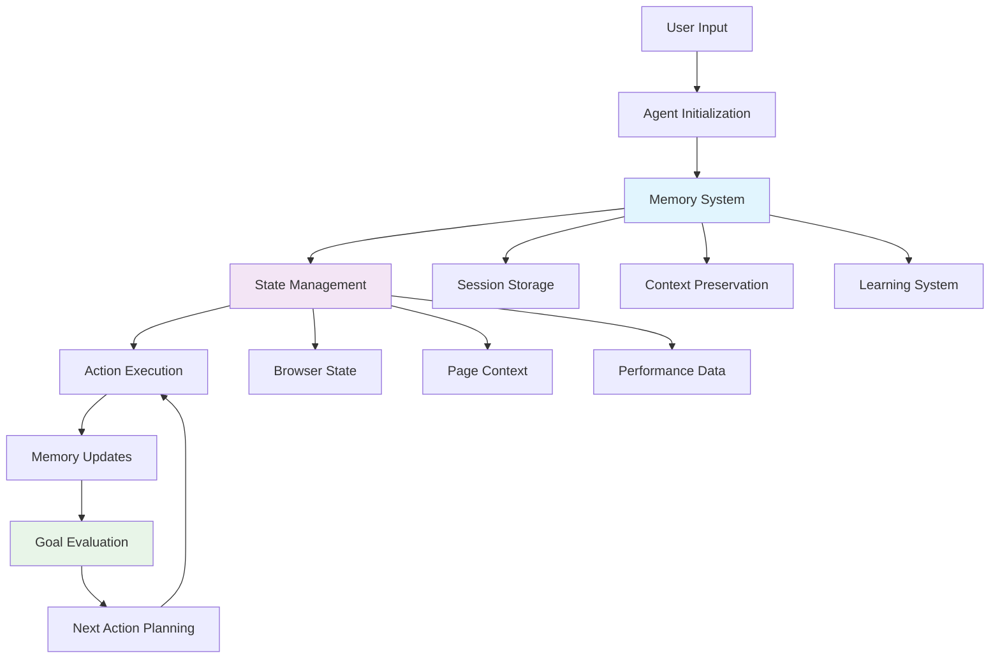
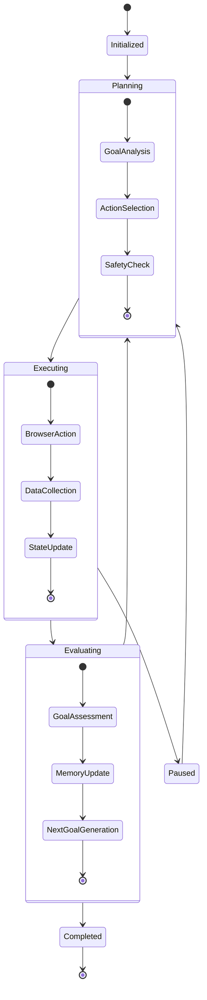
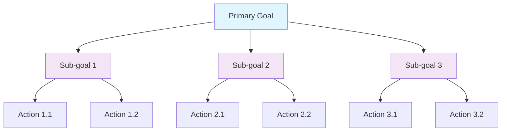
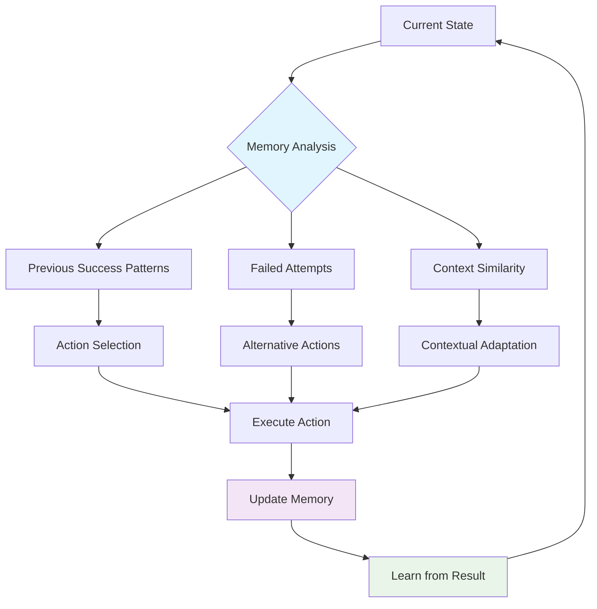
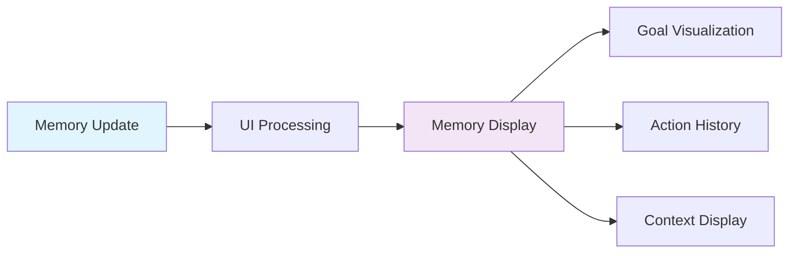

# Memory Management and Agent Architecture

## Overview

Bugzer Browser implements a sophisticated memory management system and agent architecture that enables intelligent, context-aware web testing. This document details how memory works, the agent structure, and the functionality that powers our autonomous testing capabilities.

## Architecture Overview



## Memory System Architecture

### Core Memory Components

The memory system consists of several interconnected components:

```python
# Memory structure in agent output
class AgentOutput:
    current_state: BrowserState
    action: List[ActionModel]
    
class BrowserState:
    memory: str  # Current memory content
    next_goal: str  # Next objective
    evaluation_previous_goal: str  # Previous goal evaluation
```

### Memory Types

#### 1. Working Memory
Temporary memory that holds current context and immediate goals:

```python
# Working memory structure
working_memory = {
    "current_task": "Navigate to checkout page",
    "current_page": "https://example.com/products",
    "user_intent": "Purchase item",
    "session_context": {...}
}
```

#### 2. Episodic Memory
Stores specific events and experiences during the session:

```python
# Episodic memory structure
episodic_memory = {
    "actions_taken": [
        {"action": "click", "target": "add-to-cart", "timestamp": "..."},
        {"action": "navigate", "target": "checkout", "timestamp": "..."}
    ],
    "pages_visited": [...],
    "errors_encountered": [...],
    "successful_interactions": [...]
}
```

#### 3. Semantic Memory
Stores learned patterns and domain knowledge:

```python
# Semantic memory structure
semantic_memory = {
    "page_patterns": {
        "checkout_flow": ["cart", "shipping", "payment", "confirmation"],
        "login_pattern": ["username", "password", "submit"]
    },
    "error_patterns": {
        "form_validation": ["required_field", "invalid_format"],
        "network_errors": ["timeout", "connection_failed"]
    }
}
```

## Agent State Management

### State Flow Diagram



### Session-Aware Controller

Our custom controller manages agent state across sessions:

```python
class SessionAwareController(Controller):
    def __init__(self, *args, **kwargs):
        super().__init__(*args, **kwargs)
        self.session_id = None
        self.agent = None
        self.finished = False
        self.memory_context = {}
        self.goal_history = []
        self.action_history = []

    def set_session_id(self, session_id: str):
        """Initialize session-specific state"""
        self.session_id = session_id
        self.finished = False
        self.memory_context = {}
        self.goal_history = []
        self.action_history = []
```

### Memory Context Management

```python
def _get_memory_context(self) -> Dict[str, Any]:
    """Get current memory context for the session"""
    return {
        "session_id": self.session_id,
        "current_goal": self.goal_history[-1] if self.goal_history else None,
        "previous_goals": self.goal_history[-5:],  # Last 5 goals
        "recent_actions": self.action_history[-10:],  # Last 10 actions
        "page_context": self._get_current_page_context(),
        "performance_data": self._get_performance_context()
    }
```

## Memory Update Mechanisms

### Real-time Memory Updates

The system updates memory after each action:

```python
def yield_data(browser_state: "BrowserState", agent_output: "AgentOutput", step_number: int):
    """Callback function that processes memory updates"""
    
    # Update memory with current state
    if agent_output.current_state.memory:
        memory_update = AIMessage(content=f"*Memory*:\n{agent_output.current_state.memory}")
        asyncio.get_event_loop().call_soon_threadsafe(queue.put_nowait, memory_update)
    
    # Update next goal
    if agent_output.current_state.next_goal:
        goal_update = AIMessage(content=f"*Next Goal*:\n{agent_output.current_state.next_goal}")
        asyncio.get_event_loop().call_soon_threadsafe(queue.put_nowait, goal_update)
    
    # Update previous goal evaluation
    if step_number > 2 and agent_output.current_state.evaluation_previous_goal:
        evaluation_update = AIMessage(content=f"*Previous Goal*:\n{agent_output.current_state.evaluation_previous_goal}")
        asyncio.get_event_loop().call_soon_threadsafe(queue.put_nowait, evaluation_update)
```

### Memory Persistence

```python
# Global session storage for memory persistence
session_metrics_storage: Dict[str, Dict[str, Dict[str, Any]]] = defaultdict(
    lambda: {"pages": {}, "memory": {}, "goals": []}
)

def _store_memory_update(self, memory_type: str, content: str):
    """Store memory updates in session storage"""
    if not self.session_id:
        return
    
    session_data = self._get_current_session_metrics()
    if "memory" not in session_data:
        session_data["memory"] = {}
    
    session_data["memory"][memory_type] = {
        "content": content,
        "timestamp": time.time(),
        "step_number": getattr(self, 'current_step', 0)
    }
```

## Goal Management System

### Goal Hierarchy



### Goal Evaluation Process

```python
def evaluate_goal_completion(current_goal: str, current_state: Dict[str, Any]) -> Dict[str, Any]:
    """Evaluate whether current goal has been completed"""
    evaluation = {
        "goal": current_goal,
        "status": "in_progress",
        "completion_percentage": 0,
        "next_actions": [],
        "obstacles": []
    }
    
    # Analyze current page state
    page_analysis = analyze_page_state(current_state["current_page"])
    
    # Check for goal-specific completion criteria
    if "checkout" in current_goal.lower():
        if "checkout" in page_analysis["url"] or "payment" in page_analysis["content"]:
            evaluation["status"] = "completed"
            evaluation["completion_percentage"] = 100
        else:
            evaluation["completion_percentage"] = calculate_progress(current_goal, page_analysis)
    
    return evaluation
```

### Dynamic Goal Generation

```python
def generate_next_goal(current_context: Dict[str, Any], memory: str) -> str:
    """Generate next goal based on current context and memory"""
    
    # Analyze current state
    current_page = current_context.get("current_page", {})
    recent_actions = current_context.get("recent_actions", [])
    
    # Use memory to inform goal generation
    if "checkout" in memory.lower():
        if "cart" in current_page.get("url", ""):
            return "Navigate to checkout page"
        elif "shipping" in current_page.get("url", ""):
            return "Fill shipping information"
    
    # Default goal generation based on page analysis
    return analyze_page_and_generate_goal(current_page)
```

## Learning and Adaptation

### Pattern Recognition

The system learns from successful and failed interactions:

```python
class PatternLearner:
    def __init__(self):
        self.successful_patterns = {}
        self.failed_patterns = {}
        self.page_patterns = {}
    
    def learn_from_interaction(self, action: str, result: str, context: Dict[str, Any]):
        """Learn from interaction results"""
        pattern_key = self._generate_pattern_key(action, context)
        
        if result == "success":
            self.successful_patterns[pattern_key] = self.successful_patterns.get(pattern_key, 0) + 1
        else:
            self.failed_patterns[pattern_key] = self.failed_patterns.get(pattern_key, 0) + 1
    
    def get_recommended_action(self, context: Dict[str, Any]) -> str:
        """Get recommended action based on learned patterns"""
        # Analyze context and return best action based on learned patterns
        pass
```

### Memory Consolidation

```python
def consolidate_memory(session_data: Dict[str, Any]) -> Dict[str, Any]:
    """Consolidate memory data for long-term storage"""
    consolidated = {
        "session_summary": generate_session_summary(session_data),
        "key_learnings": extract_key_learnings(session_data),
        "successful_patterns": identify_successful_patterns(session_data),
        "failed_patterns": identify_failed_patterns(session_data),
        "performance_insights": extract_performance_insights(session_data)
    }
    
    return consolidated
```

## Context Preservation

### Multi-Page Context

The system maintains context across page navigations:

```python
def preserve_context_across_pages(old_page: str, new_page: str, context: Dict[str, Any]):
    """Preserve context when navigating between pages"""
    preserved_context = {
        "navigation_history": context.get("navigation_history", []) + [old_page],
        "current_session_goals": context.get("current_session_goals", []),
        "user_intent": context.get("user_intent"),
        "session_data": context.get("session_data", {}),
        "performance_baseline": context.get("performance_baseline", {})
    }
    
    return preserved_context
```

### Session Continuity

```python
def maintain_session_continuity(session_id: str, new_context: Dict[str, Any]):
    """Maintain continuity across session resumptions"""
    if session_id in session_metrics_storage:
        existing_context = session_metrics_storage[session_id].get("context", {})
        
        # Merge contexts intelligently
        merged_context = {
            **existing_context,
            **new_context,
            "session_resumed": True,
            "resume_timestamp": time.time()
        }
        
        session_metrics_storage[session_id]["context"] = merged_context
```

## Memory-Driven Decision Making

### Decision Tree with Memory



### Memory-Based Action Selection

```python
def select_action_with_memory(current_state: Dict[str, Any], available_actions: List[str]) -> str:
    """Select best action based on memory and current state"""
    
    # Get relevant memory
    relevant_memory = get_relevant_memory(current_state)
    
    # Score each action based on memory
    action_scores = {}
    for action in available_actions:
        score = calculate_action_score(action, current_state, relevant_memory)
        action_scores[action] = score
    
    # Select highest scoring action
    best_action = max(action_scores, key=action_scores.get)
    
    return best_action

def calculate_action_score(action: str, state: Dict[str, Any], memory: Dict[str, Any]) -> float:
    """Calculate score for action based on memory"""
    score = 0.0
    
    # Check for successful patterns
    if action in memory.get("successful_patterns", {}):
        score += memory["successful_patterns"][action] * 0.3
    
    # Check for failed patterns
    if action in memory.get("failed_patterns", {}):
        score -= memory["failed_patterns"][action] * 0.2
    
    # Check context similarity
    context_similarity = calculate_context_similarity(state, memory.get("context", {}))
    score += context_similarity * 0.5
    
    return score
```

## Performance Optimization

### Memory Efficiency

```python
# Efficient memory storage with size limits
MAX_MEMORY_ENTRIES = 1000
MAX_GOAL_HISTORY = 50
MAX_ACTION_HISTORY = 200

def optimize_memory_storage(session_data: Dict[str, Any]):
    """Optimize memory storage to prevent memory bloat"""
    
    # Limit memory entries
    if "memory" in session_data:
        memory_entries = list(session_data["memory"].items())
        if len(memory_entries) > MAX_MEMORY_ENTRIES:
            # Keep most recent entries
            session_data["memory"] = dict(memory_entries[-MAX_MEMORY_ENTRIES:])
    
    # Limit goal history
    if "goals" in session_data and len(session_data["goals"]) > MAX_GOAL_HISTORY:
        session_data["goals"] = session_data["goals"][-MAX_GOAL_HISTORY:]
    
    # Limit action history
    if "actions" in session_data and len(session_data["actions"]) > MAX_ACTION_HISTORY:
        session_data["actions"] = session_data["actions"][-MAX_ACTION_HISTORY:]
```

### Lazy Loading

```python
def lazy_load_memory_data(session_id: str, memory_type: str):
    """Load memory data only when needed"""
    if session_id not in session_metrics_storage:
        return None
    
    session_data = session_metrics_storage[session_id]
    
    # Load only requested memory type
    if memory_type in session_data.get("memory", {}):
        return session_data["memory"][memory_type]
    
    return None
```

## Error Recovery and Memory

### Error Context Preservation

```python
def preserve_error_context(error: Exception, context: Dict[str, Any]):
    """Preserve context when errors occur"""
    error_context = {
        "error_type": type(error).__name__,
        "error_message": str(error),
        "context_at_error": context,
        "timestamp": time.time(),
        "recovery_suggestions": generate_recovery_suggestions(error, context)
    }
    
    return error_context
```

### Memory-Based Recovery

```python
def recover_from_error_with_memory(error_context: Dict[str, Any], session_memory: Dict[str, Any]):
    """Use memory to recover from errors"""
    
    # Look for similar error patterns in memory
    similar_errors = find_similar_errors(error_context, session_memory)
    
    if similar_errors:
        # Use successful recovery patterns
        recovery_action = get_recovery_action_from_memory(similar_errors)
        return recovery_action
    
    # Default recovery strategy
    return get_default_recovery_strategy(error_context)
```

## Integration with UI

### Real-time Memory Display

The UI displays memory updates in real-time:

```python
# Memory updates sent to UI
def send_memory_to_ui(memory_content: str, memory_type: str):
    """Send memory updates to UI for display"""
    message = AIMessage(content=f"*{memory_type}*:\n{memory_content}")
    asyncio.get_event_loop().call_soon_threadsafe(queue.put_nowait, message)
    asyncio.get_event_loop().call_soon_threadsafe(queue.put_nowait, {"stop": True})
```

### Memory Visualization



## Future Enhancements

### Advanced Memory Features

1. **Semantic Memory Networks:**
   - Graph-based memory representation
   - Relationship mapping between concepts
   - Advanced pattern recognition

2. **Predictive Memory:**
   - Anticipate user needs
   - Proactive goal generation
   - Context-aware suggestions

3. **Memory Compression:**
   - Efficient storage algorithms
   - Automatic memory cleanup
   - Intelligent memory prioritization

### Machine Learning Integration

1. **Memory-Based Learning:**
   - Reinforcement learning from memory
   - Pattern recognition improvements
   - Adaptive behavior modification

2. **Predictive Analytics:**
   - Success probability prediction
   - Optimal action sequence generation
   - Performance optimization

This comprehensive memory management and agent architecture provides the foundation for intelligent, adaptive web testing that learns from experience and maintains context across complex user journeys.

