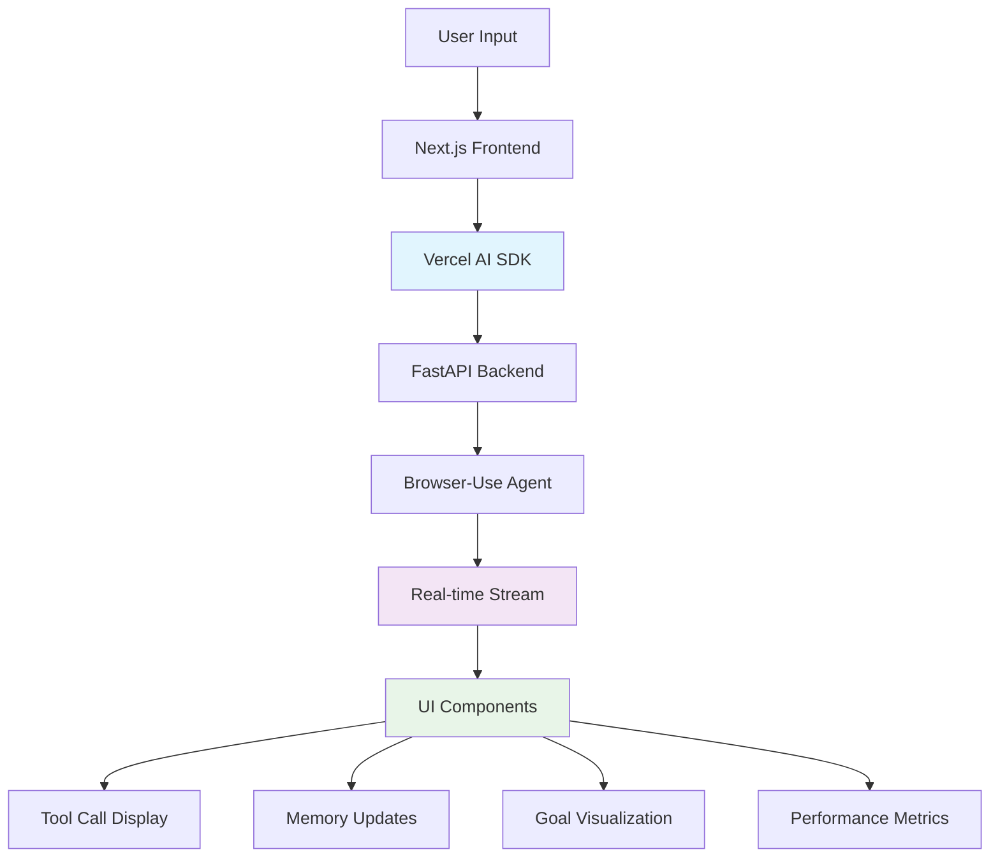
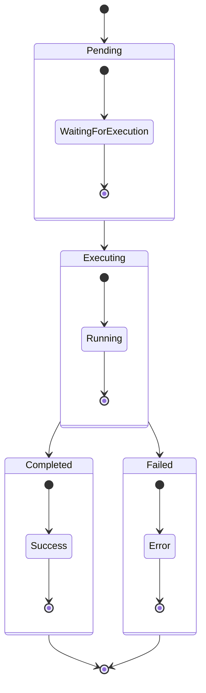
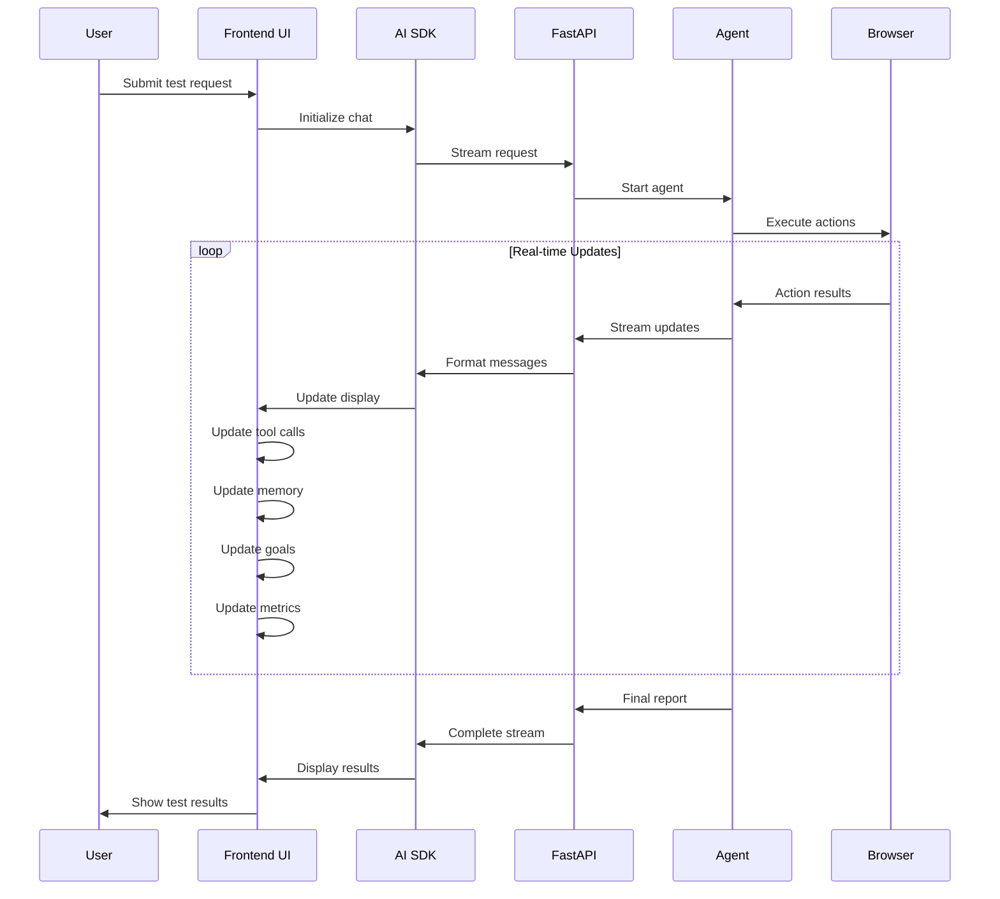

# UI AI SDK Integration and Real-time Updates

## Overview

Bugzer Browser leverages the Vercel AI SDK (`ai` package) to provide seamless real-time communication between the backend agent and the frontend UI. This integration enables live updates, tool call visualization, and interactive user experiences during automated testing sessions.

## Architecture Overview



## Vercel AI SDK Integration

### Core Dependencies

```json
{
  "dependencies": {
    "ai": "4.0.30",
    "@ai-sdk/ui-utils": "1.0.7"
  }
}
```

### Chat Hook Implementation

The main chat functionality is implemented using the `useChat` hook:

```typescript
// app/chat/page.tsx
const chatState = useChat({
  api: "/api/chat",
  id: currentSession?.id || undefined,
  maxSteps: 10,
  initialMessages: initialMessage
    ? [{ id: "1", role: "user", content: initialMessage }]
    : undefined,
  body: chatBodyConfig,
  onFinish: message => {
    console.log("[CHAT] Chat finished message:", message.id);
  },
  onError: error => {
    console.error("[CHAT] Chat error:", error);
    toast({
      title: "Error",
      description: error?.message || "An unexpected error occurred",
      className: "text-[var(--gray-12)] border border-[var(--red-11)] bg-[var(--red-2)] text-sm",
    });
  },
  onToolCall: toolCallEvent => {
    console.log("[CHAT] Tool call received:", JSON.stringify(toolCallEvent, null, 2));
  },
});
```

## Streaming Architecture

### Backend Streaming

The backend uses FastAPI's streaming capabilities with Vercel AI SDK format:

```python
# api/streamer.py
async def stream_vercel_format(stream: AsyncGenerator[str, None]) -> AsyncGenerator[str, None]:
    """Convert internal stream format to Vercel AI SDK format"""
    
    pending_tool_calls = set()
    
    async for chunk in stream:
        # Handle different message types
        if hasattr(chunk, "content") and chunk.content:
            # Text content
            if isinstance(chunk.content, list):
                for item in chunk.content:
                    if item.get("type") == "text":
                        yield f"0:{json.dumps(item['text'])}\n"
            else:
                yield f"0:{json.dumps(chunk.content)}\n"
        
        # Handle tool calls
        elif hasattr(chunk, "tool_calls") and chunk.tool_calls:
            for tool_call in chunk.tool_calls:
                pending_tool_calls.add(tool_call.get("id"))
                yield f'9:{{"toolCallId":"{tool_call.get("id")}","toolName":"{tool_call.get("name")}","args":{json.dumps(tool_call.get("args"))}}}\n'
        
        # Handle tool results
        elif hasattr(chunk, "tool_call_id") and chunk.tool_call_id:
            if chunk.tool_call_id in pending_tool_calls:
                pending_tool_calls.remove(chunk.tool_call_id)
            yield f'a:{{"toolCallId":"{chunk.tool_call_id}","result":{json.dumps(chunk.content)}}}\n'
```

### Frontend Stream Processing

The frontend processes the streamed data in real-time:

```typescript
// Real-time message processing
const processStreamMessage = (message: string) => {
  const [prefix, content] = message.split(':', 2);
  
  switch (prefix) {
    case '0': // Text content
      const textContent = JSON.parse(content);
      addMessage({ role: 'assistant', content: textContent });
      break;
      
    case '9': // Tool call
      const toolCall = JSON.parse(content);
      addToolCall(toolCall);
      break;
      
    case 'a': // Tool result
      const toolResult = JSON.parse(content);
      updateToolCallResult(toolResult);
      break;
      
    case 'e': // Finish reason
      const finishData = JSON.parse(content);
      handleFinish(finishData);
      break;
  }
};
```

## Tool Call Visualization

### Tool Call Display Component

```typescript
// components/ui/tool.tsx
export const ToolInvocations = ({
  toolInvocations,
  onImageClick,
}: {
  toolInvocations: ToolInvocation[];
  onImageClick?: (imageUrl: string) => void;
}) => {
  const filteredTools = toolInvocation => {
    // Filter out empty or irrelevant tool calls
    return toolInvocation.toolName !== "print_call" || 
           (toolInvocation.args?.message && 
            typeof toolInvocation.args.message === "string" && 
            toolInvocation.args.message.trim() !== "");
  };

  return (
    <div className="flex w-full flex-col gap-2">
      {filteredTools.map((toolInvocation, index) => {
        const { toolName, args, state } = toolInvocation;

        // Special handling for print_call tools
        if (toolName === "print_call") {
          const message = args?.message;
          return (
            <div key={index} className="text-sm text-[--gray-12]">
              {message}
            </div>
          );
        }

        const displayToolName = capitalizeAndReplaceUnderscores(toolName);
        const entries = Object.entries(args || {});

        return (
          <div key={toolInvocation.toolCallId} className="tool-call-container">
            <div className="tool-name">{displayToolName}</div>
            <div className="tool-args">
              {entries.map(([key, value]) => (
                <div key={key} className="tool-arg">
                  <span className="arg-key">{key}:</span>
                  <span className="arg-value">{String(value)}</span>
                </div>
              ))}
            </div>
          </div>
        );
      })}
    </div>
  );
};
```

### Tool Call States



## Real-time UI Updates

### Memory Updates Display

The system displays memory updates in real-time:

```typescript
// Memory update processing
const processMemoryUpdate = (content: string) => {
  if (content.includes("*Memory*:")) {
    const memoryContent = content.split("*Memory*:")[1]?.trim();
    if (memoryContent) {
      setCurrentMemory(memoryContent);
      // Update UI with memory visualization
    }
  }
  
  if (content.includes("*Next Goal*:")) {
    const goalContent = content.split("*Next Goal*:")[1]?.trim();
    if (goalContent) {
      setNextGoal(goalContent);
      // Update UI with goal visualization
    }
  }
  
  if (content.includes("*Previous Goal*:")) {
    const prevGoalContent = content.split("*Previous Goal*:")[1]?.trim();
    if (prevGoalContent) {
      setPreviousGoal(prevGoalContent);
      // Update UI with previous goal evaluation
    }
  }
};
```

### Performance Metrics Display

```typescript
// Performance metrics visualization
const PerformanceMetricsDisplay = ({ metrics }: { metrics: any }) => {
  return (
    <div className="performance-metrics">
      <div className="metric-group">
        <h3>Page Load Time</h3>
        <div className="metric-value">
          {metrics.pageLoadTime}ms
        </div>
      </div>
      
      <div className="metric-group">
        <h3>Network Requests</h3>
        <div className="metric-value">
          {metrics.networkRequests?.length || 0}
        </div>
      </div>
      
      <div className="metric-group">
        <h3>Console Errors</h3>
        <div className="metric-value error">
          {metrics.consoleErrors?.length || 0}
        </div>
      </div>
    </div>
  );
};
```

## Browser Component Integration

### Real-time Browser Display

```typescript
// components/ui/Browser.tsx
export function Browser({ isPaused }: { isPaused?: boolean }) {
  const [browserState, setBrowserState] = useState({
    url: '',
    title: '',
    loading: false,
    error: null
  });

  // Real-time browser state updates
  useEffect(() => {
    const eventSource = new EventSource('/api/browser-state');
    
    eventSource.onmessage = (event) => {
      const data = JSON.parse(event.data);
      setBrowserState(prev => ({
        ...prev,
        ...data
      }));
    };

    return () => eventSource.close();
  }, []);

  return (
    <div className="browser-container">
      <div className="browser-header">
        <div className="browser-url">{browserState.url}</div>
        <div className="browser-title">{browserState.title}</div>
      </div>
      
      <div className="browser-content">
        {browserState.loading && <div className="loading-indicator" />}
        {browserState.error && <div className="error-message">{browserState.error}</div>}
      </div>
    </div>
  );
}
```

## Context Management

### Chat Context Provider

```typescript
// app/contexts/ChatContext.tsx
interface ChatContextType {
  initialMessage: string | null;
  setInitialMessage: (message: string | null) => void;
  shouldAutoSubmit: boolean;
  setShouldAutoSubmit: (should: boolean) => void;
  clearInitialState: () => void;
}

export function ChatProvider({ children }: { children: React.ReactNode }) {
  const [initialMessage, setInitialMessage] = useLocalStorage<string | null>(
    "initialMessage",
    null
  );
  const [shouldAutoSubmit, setShouldAutoSubmit] = useLocalStorage<boolean>(
    "shouldAutoSubmit",
    false
  );

  const clearInitialState = () => {
    setInitialMessage(null);
    setShouldAutoSubmit(false);
  };

  return (
    <ChatContext.Provider
      value={{
        initialMessage,
        setInitialMessage,
        shouldAutoSubmit,
        setShouldAutoSubmit,
        clearInitialState,
      }}
    >
      {children}
    </ChatContext.Provider>
  );
}
```

### Session Management

```typescript
// Session state management
const useSessionState = () => {
  const [currentSession, setCurrentSession] = useState(null);
  const [sessionHistory, setSessionHistory] = useState([]);
  
  const createSession = async (config: SessionConfig) => {
    const response = await fetch('/api/sessions', {
      method: 'POST',
      headers: { 'Content-Type': 'application/json' },
      body: JSON.stringify(config)
    });
    
    const session = await response.json();
    setCurrentSession(session);
    setSessionHistory(prev => [...prev, session]);
    
    return session;
  };
  
  return { currentSession, sessionHistory, createSession };
};
```

## Error Handling and Recovery

### Error Display System

```typescript
// Error handling in UI
const ErrorDisplay = ({ error }: { error: Error }) => {
  return (
    <div className="error-container">
      <div className="error-header">
        <h3>Error Occurred</h3>
      </div>
      <div className="error-content">
        <p className="error-message">{error.message}</p>
        <div className="error-actions">
          <button onClick={() => window.location.reload()}>
            Retry
          </button>
          <button onClick={() => clearError()}>
            Dismiss
          </button>
        </div>
      </div>
    </div>
  );
};
```

### Recovery Mechanisms

```typescript
// Automatic recovery from errors
const useErrorRecovery = () => {
  const [errorCount, setErrorCount] = useState(0);
  const [lastError, setLastError] = useState(null);
  
  const handleError = (error: Error) => {
    setErrorCount(prev => prev + 1);
    setLastError(error);
    
    // Automatic recovery for certain error types
    if (error.message.includes('network') && errorCount < 3) {
      setTimeout(() => {
        retryConnection();
      }, 2000);
    }
  };
  
  return { handleError, errorCount, lastError };
};
```

## Performance Optimization

### Message Batching

```typescript
// Batch messages for better performance
const useMessageBatching = () => {
  const [messageQueue, setMessageQueue] = useState([]);
  const [isProcessing, setIsProcessing] = useState(false);
  
  const addMessage = (message: Message) => {
    setMessageQueue(prev => [...prev, message]);
  };
  
  const processBatch = useCallback(async () => {
    if (isProcessing || messageQueue.length === 0) return;
    
    setIsProcessing(true);
    const batch = messageQueue.splice(0, 10); // Process 10 messages at a time
    
    for (const message of batch) {
      await processMessage(message);
    }
    
    setIsProcessing(false);
  }, [messageQueue, isProcessing]);
  
  useEffect(() => {
    const interval = setInterval(processBatch, 100);
    return () => clearInterval(interval);
  }, [processBatch]);
};
```

### Virtual Scrolling

```typescript
// Virtual scrolling for large message lists
const VirtualizedMessageList = ({ messages }: { messages: Message[] }) => {
  const [visibleRange, setVisibleRange] = useState({ start: 0, end: 50 });
  
  const visibleMessages = messages.slice(visibleRange.start, visibleRange.end);
  
  return (
    <div className="message-list-container">
      {visibleMessages.map((message, index) => (
        <MessageComponent
          key={message.id}
          message={message}
          index={visibleRange.start + index}
        />
      ))}
    </div>
  );
};
```

## Real-time Data Flow

### Complete Data Flow Diagram



## Custom UI Components

### Tool Call Status Indicator

```typescript
const ToolCallStatus = ({ status, toolName }: { status: string, toolName: string }) => {
  const getStatusIcon = () => {
    switch (status) {
      case 'pending': return <ClockIcon className="w-4 h-4 text-yellow-500" />;
      case 'executing': return <SpinnerIcon className="w-4 h-4 text-blue-500 animate-spin" />;
      case 'completed': return <CheckIcon className="w-4 h-4 text-green-500" />;
      case 'failed': return <XIcon className="w-4 h-4 text-red-500" />;
      default: return <QuestionMarkIcon className="w-4 h-4 text-gray-500" />;
    }
  };
  
  return (
    <div className="tool-status">
      {getStatusIcon()}
      <span className="tool-name">{toolName}</span>
      <span className="tool-status-text">{status}</span>
    </div>
  );
};
```

### Memory Visualization

```typescript
const MemoryVisualization = ({ memory }: { memory: string }) => {
  const memoryLines = memory.split('\n').filter(line => line.trim());
  
  return (
    <div className="memory-container">
      <h3>Current Memory</h3>
      <div className="memory-content">
        {memoryLines.map((line, index) => (
          <div key={index} className="memory-line">
            {line}
          </div>
        ))}
      </div>
    </div>
  );
};
```

## Future Enhancements

### Advanced UI Features

1. **Interactive Debugging:**
   - Step-through execution
   - Breakpoint support
   - Variable inspection

2. **Visual Test Flow:**
   - Flowchart visualization
   - Interactive test editing
   - Drag-and-drop test building

3. **Real-time Collaboration:**
   - Multi-user sessions
   - Live commenting
   - Shared test environments

### Performance Improvements

1. **WebSocket Integration:**
   - Real-time bidirectional communication
   - Reduced latency
   - Better error handling

2. **Progressive Loading:**
   - Incremental data loading
   - Background processing
   - Optimized rendering

3. **Caching Strategies:**
   - Intelligent data caching
   - Offline support
   - Data persistence

This comprehensive UI AI SDK integration provides a seamless, real-time experience for users interacting with the automated testing system, enabling them to monitor progress, understand agent decisions, and intervene when necessary.

