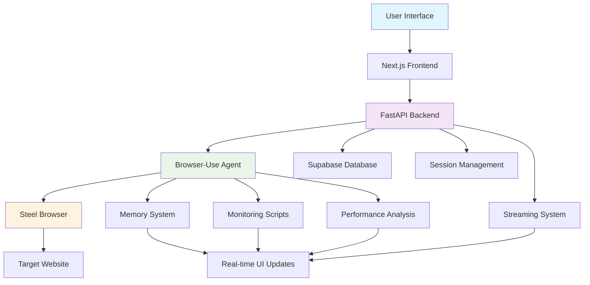
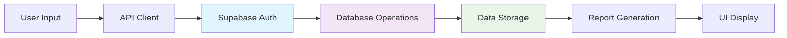
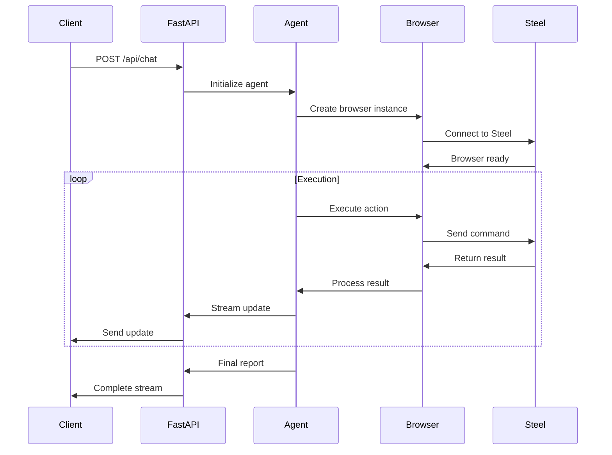
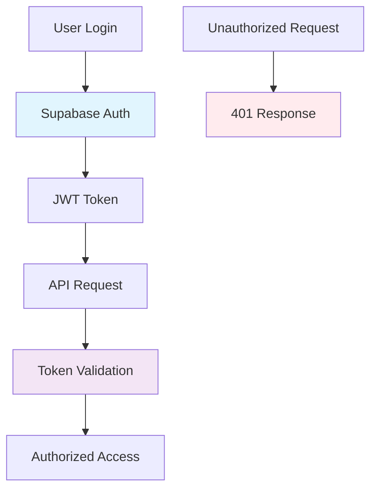
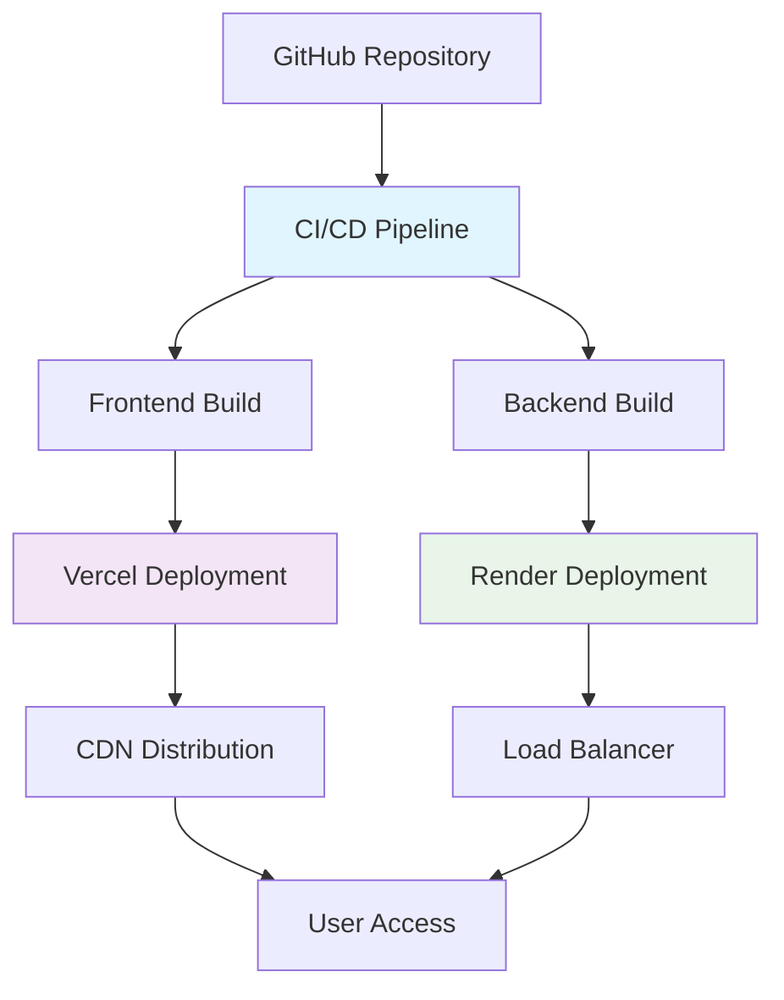
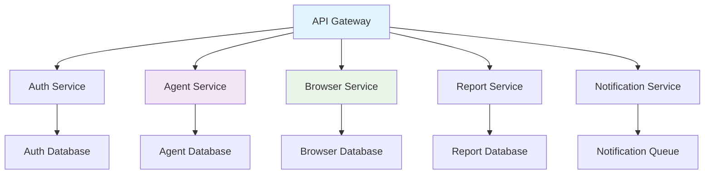

# System Architecture and Infrastructure

## Overview

Bugzer Browser is a comprehensive web testing platform that combines AI-powered browser automation with real-time monitoring and reporting. This document provides a detailed overview of the system architecture, infrastructure components, and how they work together to deliver automated web testing capabilities.

## High-Level Architecture



## Frontend Architecture

### Next.js Application Structure

```
app/
├── (auth-pages)/          # Authentication pages
├── chat/                  # Main chat interface
├── reports/               # Test reports and history
├── contexts/              # React context providers
├── hooks/                 # Custom React hooks
├── providers/             # External service providers
└── stores/                # State management

components/
├── ui/                    # Reusable UI components
├── markdown/              # Markdown rendering
├── landing/               # Landing page components
└── report/                # Report-specific components
```

### Key Frontend Technologies

- **Next.js 14**: React framework with App Router
- **TypeScript**: Type-safe development
- **Tailwind CSS**: Utility-first styling
- **Framer Motion**: Animation library
- **Radix UI**: Accessible component primitives
- **Vercel AI SDK**: Real-time AI communication

### State Management

```typescript
// Zustand store for timer management
interface TimerStore {
  isRunning: boolean;
  startTime: number | null;
  elapsedTime: number;
  start: () => void;
  stop: () => void;
  reset: () => void;
}

// React Context for chat state
interface ChatContextType {
  initialMessage: string | null;
  setInitialMessage: (message: string | null) => void;
  shouldAutoSubmit: boolean;
  setShouldAutoSubmit: (should: boolean) => void;
  clearInitialState: () => void;
}
```

## Backend Architecture

### FastAPI Application Structure

```
api/
├── index.py               # Main FastAPI application
├── models.py              # Data models and configurations
├── schemas.py             # Pydantic schemas
├── providers.py           # LLM provider configurations
├── streamer.py            # Streaming utilities
├── middleware/            # Custom middleware
├── plugins/               # Agent implementations
│   ├── base/              # Base agent functionality
│   └── browser_use/       # Browser automation agent
└── utils/                 # Utility functions
```

### Core Backend Components

#### 1. FastAPI Application

```python
# api/index.py
app = FastAPI()
app.add_middleware(ProfilingMiddleware)

# CORS configuration
origins = [
    "http://localhost:3000",
    "https://bugzer.bugzer.workers.dev",
    # ... other origins
]
app.add_middleware(CORSMiddleware, origins=origins)
```

#### 2. Model Configuration

```python
# api/models.py
class ModelProvider(str, Enum):
    OPENAI = "openai"
    ANTHROPIC = "anthropic"
    GEMINI = "gemini"
    DEEPSEEK = "deepseek"

class ModelConfig:
    def __init__(self, provider: ModelProvider, model_name: str, **kwargs):
        self.provider = provider
        self.model_name = model_name
        self.temperature = kwargs.get('temperature', 0.7)
        self.max_tokens = kwargs.get('max_tokens', 1024)
```

#### 3. Plugin System

```python
# api/plugins/__init__.py
class WebAgentType(str, Enum):
    BROWSER_USE = "browser_use"
    BASE = "base"

def get_web_agent(agent_type: WebAgentType):
    """Factory function for creating agents"""
    if agent_type == WebAgentType.BROWSER_USE:
        return browser_use_agent
    elif agent_type == WebAgentType.BASE:
        return base_agent
```

## Database Architecture

### Supabase Integration

```typescript
// utils/supabase/client.ts
export const createClient = () => {
  return createBrowserClient();
};

// Database schema
interface Test {
  id: string;
  url: string;
  context: string;
  user_id: string;
  created_at: string;
  updated_at: string;
}

interface Report {
  id: string;
  test_id: string;
  results: any;
  completed_at: string;
  duration: number;
  user_id: string;
  feedback?: Feedback;
}
```

### Data Flow



## Browser Automation Architecture

### Steel Browser Integration

```python
# Steel browser configuration
STEEL_CONNECT_URL = os.getenv("STEEL_CONNECT_URL")
STEEL_API_KEY = os.getenv("STEEL_API_KEY")

browser = Browser(
    BrowserConfig(
        cdp_url=f"{STEEL_CONNECT_URL}?apiKey={STEEL_API_KEY}&sessionId={session_id}"
    )
)
```

### Session Management

```python
# Global session storage
active_browsers: Dict[str, Browser] = {}
active_browser_contexts: Dict[str, BrowserContext] = {}
session_metrics_storage: Dict[str, Dict[str, Any]] = defaultdict(lambda: {"pages": {}})

class SessionAwareController(Controller):
    def set_session_id(self, session_id: str):
        self.session_id = session_id
        self.finished = False
```

## Streaming Architecture

### Real-time Communication



### Stream Processing

```python
# api/streamer.py
async def stream_vercel_format(stream: AsyncGenerator[str, None]) -> AsyncGenerator[str, None]:
    """Convert internal stream to Vercel AI SDK format"""
    
    async for chunk in stream:
        if hasattr(chunk, "content") and chunk.content:
            yield f"0:{json.dumps(chunk.content)}\n"
        elif hasattr(chunk, "tool_calls") and chunk.tool_calls:
            for tool_call in chunk.tool_calls:
                yield f'9:{{"toolCallId":"{tool_call.get("id")}","toolName":"{tool_call.get("name")}","args":{json.dumps(tool_call.get("args"))}}}\n'
```

## Security Architecture

### Authentication Flow



### Security Measures

1. **Authentication**: Supabase Auth with JWT tokens
2. **Authorization**: Role-based access control
3. **CORS**: Configured for specific origins
4. **Data Sanitization**: Input validation and sanitization
5. **Session Isolation**: Browser sessions are isolated per user

## Performance Architecture

### Caching Strategy

```python
# Session-based caching
session_cache = {}

def get_cached_data(session_id: str, key: str):
    """Get cached data for session"""
    if session_id in session_cache:
        return session_cache[session_id].get(key)
    return None

def cache_data(session_id: str, key: str, data: Any):
    """Cache data for session"""
    if session_id not in session_cache:
        session_cache[session_id] = {}
    session_cache[session_id][key] = data
```

### Performance Monitoring

```python
# Profiling middleware
class ProfilingMiddleware:
    async def __call__(self, request: Request, call_next):
        start_time = time.time()
        response = await call_next(request)
        process_time = time.time() - start_time
        
        # Log performance metrics
        logger.info(f"Request processed in {process_time:.4f}s")
        return response
```

## Deployment Architecture

### Production Environment



### Environment Configuration

```bash
# Frontend (.env.local)
NEXT_PUBLIC_SUPABASE_URL=your_supabase_url
NEXT_PUBLIC_SUPABASE_ANON_KEY=your_supabase_anon_key
NEXT_PUBLIC_API_URL=https://bugback.onrender.com

# Backend (.env)
STEEL_API_KEY=your_steel_api_key
STEEL_API_URL=your_steel_api_url
ANTHROPIC_API_KEY=your_anthropic_api_key
SUPABASE_SERVICE_ROLE_KEY=your_supabase_service_key
```

## Monitoring and Observability

### Logging Strategy

```python
# Structured logging
import logging
import json

logger = logging.getLogger(__name__)

def log_structured_event(event_type: str, data: Dict[str, Any]):
    """Log structured events for monitoring"""
    log_data = {
        "timestamp": time.time(),
        "event_type": event_type,
        "session_id": data.get("session_id"),
        "data": data
    }
    logger.info(json.dumps(log_data))
```

### Health Checks

```python
# Health check endpoint
@app.get("/health")
async def health_check():
    """System health check"""
    return {
        "status": "healthy",
        "timestamp": time.time(),
        "version": "1.0.0",
        "services": {
            "database": check_database_connection(),
            "steel": check_steel_connection(),
            "llm": check_llm_connection()
        }
    }
```

## Scalability Considerations

### Horizontal Scaling

1. **Stateless Design**: Backend services are stateless
2. **Session Storage**: External session storage (Supabase)
3. **Load Balancing**: Multiple backend instances
4. **CDN**: Global content delivery

### Performance Optimization

1. **Connection Pooling**: Database connection pooling
2. **Caching**: Redis for session caching
3. **Async Processing**: Non-blocking I/O operations
4. **Resource Management**: Proper cleanup of browser resources

## Error Handling Architecture

### Error Recovery

```python
# Error handling strategy
class ErrorHandler:
    def __init__(self):
        self.retry_count = 0
        self.max_retries = 3
    
    async def handle_error(self, error: Exception, context: Dict[str, Any]):
        """Handle errors with retry logic"""
        if self.retry_count < self.max_retries:
            self.retry_count += 1
            await asyncio.sleep(2 ** self.retry_count)  # Exponential backoff
            return await self.retry_operation(context)
        else:
            return await self.fallback_operation(context)
```

### Circuit Breaker Pattern

```python
# Circuit breaker for external services
class CircuitBreaker:
    def __init__(self, failure_threshold: int = 5, timeout: int = 60):
        self.failure_threshold = failure_threshold
        self.timeout = timeout
        self.failure_count = 0
        self.last_failure_time = None
        self.state = "CLOSED"  # CLOSED, OPEN, HALF_OPEN
```

## Future Architecture Enhancements

### Microservices Migration



### Advanced Features

1. **Event Sourcing**: Complete audit trail of all actions
2. **CQRS**: Separate read and write models
3. **Message Queues**: Asynchronous processing
4. **Container Orchestration**: Kubernetes deployment
5. **Service Mesh**: Istio for service communication

This comprehensive system architecture provides a robust foundation for scalable, maintainable web testing automation with real-time monitoring and reporting capabilities.

