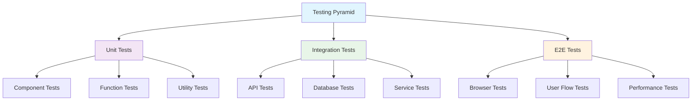

# Testing, Deployment, and DevOps

## Overview

This document covers the testing strategies, deployment processes, and DevOps practices used in Bugzer Browser. It includes information about testing frameworks, CI/CD pipelines, deployment strategies, and monitoring practices.

## Testing Architecture

### Testing Strategy Overview



### Frontend Testing

#### Jest Configuration

```javascript
// jest.config.js
module.exports = {
  testEnvironment: 'jsdom',
  setupFilesAfterEnv: ['<rootDir>/jest.setup.js'],
  moduleNameMapping: {
    '^@/(.*)$': '<rootDir>/$1',
  },
  collectCoverageFrom: [
    'components/**/*.{js,jsx,ts,tsx}',
    'app/**/*.{js,jsx,ts,tsx}',
    '!**/*.d.ts',
    '!**/node_modules/**',
  ],
  testMatch: [
    '<rootDir>/app/tests/**/*.{js,jsx,ts,tsx}',
    '<rootDir>/components/**/*.{js,jsx,ts,tsx}',
  ],
};
```

#### Test Setup

```javascript
// jest.setup.js
import '@testing-library/jest-dom';

// Mock Next.js router
jest.mock('next/navigation', () => ({
  useRouter: () => ({
    push: jest.fn(),
    replace: jest.fn(),
    prefetch: jest.fn(),
  }),
  usePathname: () => '/',
}));

// Mock Supabase client
jest.mock('@/utils/supabase/client', () => ({
  createClient: () => ({
    auth: {
      getUser: jest.fn(),
      getSession: jest.fn(),
    },
    from: jest.fn(() => ({
      select: jest.fn(),
      insert: jest.fn(),
      update: jest.fn(),
      delete: jest.fn(),
    })),
  }),
}));
```

#### Component Testing Examples

```typescript
// app/tests/CodeBlock.test.tsx
import { render, screen } from '@testing-library/react';
import { CodeBlock } from '@/components/markdown/CodeBlock';

describe('CodeBlock Component', () => {
  it('renders code with syntax highlighting', () => {
    const code = 'const hello = "world";';
    const language = 'javascript';
    
    render(<CodeBlock code={code} language={language} />);
    
    expect(screen.getByText('const hello = "world";')).toBeInTheDocument();
  });
  
  it('handles copy functionality', async () => {
    const code = 'test code';
    render(<CodeBlock code={code} language="text" />);
    
    const copyButton = screen.getByRole('button', { name: /copy/i });
    await user.click(copyButton);
    
    // Verify copy functionality
    expect(navigator.clipboard.writeText).toHaveBeenCalledWith(code);
  });
});
```

#### Hook Testing

```typescript
// hooks/useAgents.test.ts
import { renderHook, act } from '@testing-library/react';
import { useAgents } from '@/app/hooks/useAgents';

describe('useAgents Hook', () => {
  it('should initialize with empty agents list', () => {
    const { result } = renderHook(() => useAgents());
    
    expect(result.current.agents).toEqual([]);
    expect(result.current.loading).toBe(false);
  });
  
  it('should fetch agents on mount', async () => {
    const mockAgents = [
      { id: '1', name: 'Test Agent', type: 'browser_use' }
    ];
    
    // Mock API response
    global.fetch = jest.fn().mockResolvedValue({
      json: () => Promise.resolve(mockAgents),
    });
    
    const { result } = renderHook(() => useAgents());
    
    await act(async () => {
      await result.current.fetchAgents();
    });
    
    expect(result.current.agents).toEqual(mockAgents);
  });
});
```

### Backend Testing

#### Test Structure

```python
# tests/
├── conftest.py              # Pytest configuration
├── test_api/                # API endpoint tests
│   ├── test_chat.py
│   ├── test_sessions.py
│   └── test_reports.py
├── test_plugins/            # Plugin tests
│   ├── test_browser_use.py
│   └── test_base_agent.py
├── test_utils/              # Utility function tests
│   ├── test_prompt.py
│   └── test_db.py
└── fixtures/                # Test fixtures
    ├── sample_data.json
    └── mock_responses.json
```

#### Pytest Configuration

```python
# conftest.py
import pytest
import asyncio
from fastapi.testclient import TestClient
from api.index import app

@pytest.fixture(scope="session")
def event_loop():
    """Create an instance of the default event loop for the test session."""
    loop = asyncio.get_event_loop_policy().new_event_loop()
    yield loop
    loop.close()

@pytest.fixture
def client():
    """Create a test client for the FastAPI app."""
    return TestClient(app)

@pytest.fixture
def mock_steel_browser():
    """Mock Steel browser for testing."""
    class MockBrowser:
        def __init__(self, config):
            self.config = config
            self.closed = False
        
        async def close(self):
            self.closed = True
    
    return MockBrowser
```

#### API Testing Examples

```python
# tests/test_api/test_chat.py
import pytest
from fastapi.testclient import TestClient

def test_chat_endpoint(client: TestClient):
    """Test the chat endpoint."""
    response = client.post("/api/chat", json={
        "session_id": "test-session",
        "agent_type": "browser_use",
        "messages": [{"role": "user", "content": "Test message"}],
        "agent_settings": {"steps": 5},
        "model_settings": {"provider": "anthropic", "model_name": "claude-3-sonnet"}
    })
    
    assert response.status_code == 200
    assert "text/plain" in response.headers["content-type"]

def test_invalid_session_id(client: TestClient):
    """Test error handling for invalid session ID."""
    response = client.post("/api/chat", json={
        "session_id": "",
        "agent_type": "browser_use",
        "messages": [],
        "agent_settings": {},
        "model_settings": {}
    })
    
    assert response.status_code == 422  # Validation error
```

#### Agent Testing

```python
# tests/test_plugins/test_browser_use.py
import pytest
from unittest.mock import AsyncMock, patch
from api.plugins.browser_use.agent import browser_use_agent

@pytest.mark.asyncio
async def test_browser_use_agent_initialization():
    """Test browser use agent initialization."""
    model_config = ModelConfig(
        provider=ModelProvider.ANTHROPIC,
        model_name="claude-3-sonnet"
    )
    agent_settings = AgentSettings(steps=5)
    history = [{"role": "user", "content": "Test task"}]
    session_id = "test-session"
    
    with patch('api.plugins.browser_use.agent.Browser') as mock_browser:
        mock_browser.return_value = AsyncMock()
        
        # Test agent initialization
        agent_stream = browser_use_agent(
            model_config=model_config,
            agent_settings=agent_settings,
            history=history,
            session_id=session_id
        )
        
        # Verify agent was created
        assert agent_stream is not None
```

### End-to-End Testing

#### Playwright Configuration

```typescript
// playwright.config.ts
import { defineConfig } from '@playwright/test';

export default defineConfig({
  testDir: './e2e',
  fullyParallel: true,
  forbidOnly: !!process.env.CI,
  retries: process.env.CI ? 2 : 0,
  workers: process.env.CI ? 1 : undefined,
  reporter: 'html',
  use: {
    baseURL: 'http://localhost:3000',
    trace: 'on-first-retry',
  },
  projects: [
    {
      name: 'chromium',
      use: { ...devices['Desktop Chrome'] },
    },
    {
      name: 'firefox',
      use: { ...devices['Desktop Firefox'] },
    },
    {
      name: 'webkit',
      use: { ...devices['Desktop Safari'] },
    },
  ],
  webServer: {
    command: 'npm run dev',
    url: 'http://localhost:3000',
    reuseExistingServer: !process.env.CI,
  },
});
```

#### E2E Test Examples

```typescript
// e2e/auth.spec.ts
import { test, expect } from '@playwright/test';

test.describe('Authentication Flow', () => {
  test('should allow user to sign in', async ({ page }) => {
    await page.goto('/sign-in');
    
    await page.fill('[data-testid="email-input"]', 'test@example.com');
    await page.fill('[data-testid="password-input"]', 'password123');
    await page.click('[data-testid="sign-in-button"]');
    
    await expect(page).toHaveURL('/reports');
    await expect(page.locator('[data-testid="user-menu"]')).toBeVisible();
  });
  
  test('should redirect unauthenticated users', async ({ page }) => {
    await page.goto('/reports');
    await expect(page).toHaveURL('/sign-in');
  });
});

// e2e/test-execution.spec.ts
test.describe('Test Execution Flow', () => {
  test('should execute a complete test', async ({ page }) => {
    // Login
    await page.goto('/sign-in');
    await page.fill('[data-testid="email-input"]', 'test@example.com');
    await page.fill('[data-testid="password-input"]', 'password123');
    await page.click('[data-testid="sign-in-button"]');
    
    // Navigate to test creation
    await page.goto('/');
    await page.fill('[data-testid="website-url"]', 'https://example.com');
    await page.fill('[data-testid="test-context"]', 'Test the checkout process');
    await page.click('[data-testid="submit-test"]');
    
    // Wait for test to complete
    await expect(page.locator('[data-testid="test-status"]')).toContainText('Completed');
    
    // Verify report generation
    await expect(page.locator('[data-testid="report-section"]')).toBeVisible();
  });
});
```

## CI/CD Pipeline

### GitHub Actions Workflow

```yaml
# .github/workflows/ci.yml
name: CI/CD Pipeline

on:
  push:
    branches: [main, develop]
  pull_request:
    branches: [main]

jobs:
  test:
    runs-on: ubuntu-latest
    
    steps:
      - name: Checkout code
        uses: actions/checkout@v4
      
      - name: Setup Node.js
        uses: actions/setup-node@v4
        with:
          node-version: '18'
          cache: 'npm'
      
      - name: Install dependencies
        run: npm ci
      
      - name: Run linting
        run: npm run lint
      
      - name: Run frontend tests
        run: npm run test
      
      - name: Setup Python
        uses: actions/setup-python@v4
        with:
          python-version: '3.11'
      
      - name: Install Python dependencies
        run: |
          pip install -r requirements.txt
          pip install pytest pytest-asyncio
      
      - name: Run backend tests
        run: pytest tests/
      
      - name: Run E2E tests
        run: npx playwright test
      
      - name: Upload test results
        uses: actions/upload-artifact@v3
        if: always()
        with:
          name: test-results
          path: test-results/
```

### Deployment Workflow

```yaml
# .github/workflows/deploy.yml
name: Deploy

on:
  push:
    branches: [main]

jobs:
  deploy-frontend:
    runs-on: ubuntu-latest
    steps:
      - name: Checkout code
        uses: actions/checkout@v4
      
      - name: Setup Node.js
        uses: actions/setup-node@v4
        with:
          node-version: '18'
          cache: 'npm'
      
      - name: Install dependencies
        run: npm ci
      
      - name: Build application
        run: npm run build
        env:
          NEXT_PUBLIC_SUPABASE_URL: ${{ secrets.NEXT_PUBLIC_SUPABASE_URL }}
          NEXT_PUBLIC_SUPABASE_ANON_KEY: ${{ secrets.NEXT_PUBLIC_SUPABASE_ANON_KEY }}
          NEXT_PUBLIC_API_URL: ${{ secrets.NEXT_PUBLIC_API_URL }}
      
      - name: Deploy to Vercel
        uses: amondnet/vercel-action@v25
        with:
          vercel-token: ${{ secrets.VERCEL_TOKEN }}
          vercel-org-id: ${{ secrets.VERCEL_ORG_ID }}
          vercel-project-id: ${{ secrets.VERCEL_PROJECT_ID }}
          vercel-args: '--prod'

  deploy-backend:
    runs-on: ubuntu-latest
    steps:
      - name: Checkout code
        uses: actions/checkout@v4
      
      - name: Setup Python
        uses: actions/setup-python@v4
        with:
          python-version: '3.11'
      
      - name: Install dependencies
        run: |
          pip install -r requirements.txt
          pip install uv
      
      - name: Deploy to Render
        uses: render-actions/deploy@v1
        with:
          service-id: ${{ secrets.RENDER_SERVICE_ID }}
          api-key: ${{ secrets.RENDER_API_KEY }}
```

## Deployment Architecture

### Frontend Deployment (Vercel)

```json
// vercel.json
{
  "framework": "nextjs",
  "buildCommand": "npm run build",
  "devCommand": "npm run dev",
  "installCommand": "npm ci",
  "outputDirectory": ".next",
  "env": {
    "NEXT_PUBLIC_SUPABASE_URL": "@supabase-url",
    "NEXT_PUBLIC_SUPABASE_ANON_KEY": "@supabase-anon-key",
    "NEXT_PUBLIC_API_URL": "@api-url"
  },
  "functions": {
    "app/api/**/*.ts": {
      "runtime": "nodejs18.x"
    }
  }
}
```

### Backend Deployment (Render)

```yaml
# render.yaml
services:
  - type: web
    name: bugzer-api
    env: python
    buildCommand: pip install -r requirements.txt
    startCommand: uvicorn api.index:app --host 0.0.0.0 --port $PORT
    envVars:
      - key: STEEL_API_KEY
        sync: false
      - key: ANTHROPIC_API_KEY
        sync: false
      - key: SUPABASE_SERVICE_ROLE_KEY
        sync: false
    healthCheckPath: /health
```

### Environment Configuration

```bash
# Production environment variables
# Frontend (.env.production)
NEXT_PUBLIC_SUPABASE_URL=https://your-project.supabase.co
NEXT_PUBLIC_SUPABASE_ANON_KEY=your-anon-key
NEXT_PUBLIC_API_URL=https://bugback.onrender.com

# Backend (.env.production)
STEEL_API_KEY=your-steel-api-key
STEEL_API_URL=your-steel-api-url
ANTHROPIC_API_KEY=your-anthropic-api-key
SUPABASE_SERVICE_ROLE_KEY=your-service-role-key
PORT=8000
```

## Monitoring and Observability

### Application Monitoring

```python
# api/middleware/profiling_middleware.py
import time
import logging
from fastapi import Request, Response

logger = logging.getLogger(__name__)

class ProfilingMiddleware:
    async def __call__(self, request: Request, call_next):
        start_time = time.time()
        
        # Log request start
        logger.info(f"Request started: {request.method} {request.url}")
        
        response = await call_next(request)
        
        # Calculate processing time
        process_time = time.time() - start_time
        
        # Log request completion
        logger.info(
            f"Request completed: {request.method} {request.url} "
            f"Status: {response.status_code} Time: {process_time:.4f}s"
        )
        
        # Add performance headers
        response.headers["X-Process-Time"] = str(process_time)
        
        return response
```

### Health Checks

```python
# api/index.py
@app.get("/health")
async def health_check():
    """Comprehensive health check endpoint"""
    health_status = {
        "status": "healthy",
        "timestamp": time.time(),
        "version": "1.0.0",
        "services": {}
    }
    
    # Check database connection
    try:
        # Test Supabase connection
        health_status["services"]["database"] = "healthy"
    except Exception as e:
        health_status["services"]["database"] = f"unhealthy: {str(e)}"
        health_status["status"] = "degraded"
    
    # Check Steel connection
    try:
        # Test Steel API connection
        health_status["services"]["steel"] = "healthy"
    except Exception as e:
        health_status["services"]["steel"] = f"unhealthy: {str(e)}"
        health_status["status"] = "degraded"
    
    # Check LLM provider
    try:
        # Test LLM connection
        health_status["services"]["llm"] = "healthy"
    except Exception as e:
        health_status["services"]["llm"] = f"unhealthy: {str(e)}"
        health_status["status"] = "degraded"
    
    return health_status
```

### Error Tracking

```python
# Error tracking and reporting
import sentry_sdk
from sentry_sdk.integrations.fastapi import FastApiIntegration

# Initialize Sentry
sentry_sdk.init(
    dsn="your-sentry-dsn",
    integrations=[FastApiIntegration()],
    traces_sample_rate=0.1,
    environment="production"
)

# Custom error handler
@app.exception_handler(Exception)
async def global_exception_handler(request: Request, exc: Exception):
    """Global exception handler with Sentry integration"""
    sentry_sdk.capture_exception(exc)
    
    return JSONResponse(
        status_code=500,
        content={
            "detail": "Internal server error",
            "error_id": sentry_sdk.last_event_id()
        }
    )
```

## Performance Testing

### Load Testing with Locust

```python
# locustfile.py
from locust import HttpUser, task, between

class BugzerUser(HttpUser):
    wait_time = between(1, 3)
    
    def on_start(self):
        """Login before running tasks"""
        response = self.client.post("/api/auth/login", json={
            "email": "test@example.com",
            "password": "password123"
        })
        self.token = response.json()["token"]
        self.headers = {"Authorization": f"Bearer {self.token}"}
    
    @task(3)
    def create_test(self):
        """Create a new test"""
        self.client.post("/api/tests", 
            json={"url": "https://example.com", "context": "Test context"},
            headers=self.headers
        )
    
    @task(2)
    def get_reports(self):
        """Get test reports"""
        self.client.get("/api/reports", headers=self.headers)
    
    @task(1)
    def chat_endpoint(self):
        """Test chat endpoint"""
        self.client.post("/api/chat",
            json={
                "session_id": "test-session",
                "agent_type": "browser_use",
                "messages": [{"role": "user", "content": "Test message"}],
                "agent_settings": {"steps": 5},
                "model_settings": {"provider": "anthropic"}
            },
            headers=self.headers
        )
```

### Performance Monitoring

```python
# Performance metrics collection
import psutil
import time

class PerformanceMonitor:
    def __init__(self):
        self.metrics = {}
    
    def collect_metrics(self):
        """Collect system performance metrics"""
        self.metrics = {
            "timestamp": time.time(),
            "cpu_percent": psutil.cpu_percent(),
            "memory_percent": psutil.virtual_memory().percent,
            "disk_usage": psutil.disk_usage('/').percent,
            "active_sessions": len(session_metrics_storage),
            "active_browsers": len(active_browsers)
        }
        
        return self.metrics
    
    def log_metrics(self):
        """Log performance metrics"""
        metrics = self.collect_metrics()
        logger.info(f"Performance metrics: {metrics}")
```

## Security Testing

### Security Test Suite

```python
# tests/test_security.py
import pytest
from fastapi.testclient import TestClient

def test_sql_injection_protection(client: TestClient):
    """Test protection against SQL injection"""
    malicious_input = "'; DROP TABLE users; --"
    
    response = client.post("/api/tests", json={
        "url": "https://example.com",
        "context": malicious_input
    })
    
    # Should not cause database error
    assert response.status_code in [200, 400, 422]

def test_xss_protection(client: TestClient):
    """Test protection against XSS attacks"""
    xss_payload = "<script>alert('XSS')</script>"
    
    response = client.post("/api/tests", json={
        "url": "https://example.com",
        "context": xss_payload
    })
    
    # Response should not contain unescaped script tags
    assert "<script>" not in response.text

def test_rate_limiting(client: TestClient):
    """Test rate limiting functionality"""
    # Make multiple rapid requests
    for _ in range(100):
        response = client.post("/api/chat", json={
            "session_id": "test-session",
            "agent_type": "browser_use",
            "messages": [],
            "agent_settings": {},
            "model_settings": {}
        })
    
    # Should eventually hit rate limit
    assert response.status_code == 429
```

## Backup and Recovery

### Database Backup Strategy

```python
# backup_strategy.py
import asyncio
from datetime import datetime
import boto3

class BackupManager:
    def __init__(self):
        self.s3_client = boto3.client('s3')
        self.bucket_name = 'bugzer-backups'
    
    async def create_backup(self):
        """Create database backup"""
        timestamp = datetime.now().strftime('%Y%m%d_%H%M%S')
        backup_filename = f"backup_{timestamp}.sql"
        
        # Create backup using Supabase CLI or direct database dump
        # Upload to S3
        self.s3_client.upload_file(
            backup_filename,
            self.bucket_name,
            f"database/{backup_filename}"
        )
        
        return backup_filename
    
    async def restore_backup(self, backup_filename: str):
        """Restore from backup"""
        # Download from S3
        self.s3_client.download_file(
            self.bucket_name,
            f"database/{backup_filename}",
            backup_filename
        )
        
        # Restore database
        # Implementation depends on database type
```

## Disaster Recovery

### Recovery Procedures

```yaml
# disaster_recovery_plan.yml
recovery_procedures:
  database_failure:
    steps:
      - "Check database connection"
      - "Switch to backup database"
      - "Notify team"
      - "Investigate root cause"
      - "Restore from backup if needed"
  
  api_failure:
    steps:
      - "Check API health endpoint"
      - "Restart API service"
      - "Check logs for errors"
      - "Scale up if needed"
      - "Notify users if extended downtime"
  
  frontend_failure:
    steps:
      - "Check CDN status"
      - "Verify deployment"
      - "Rollback to previous version"
      - "Check for configuration issues"
      - "Monitor user reports"
```

This comprehensive testing, deployment, and DevOps documentation provides the foundation for maintaining a robust, scalable, and reliable web testing platform.

