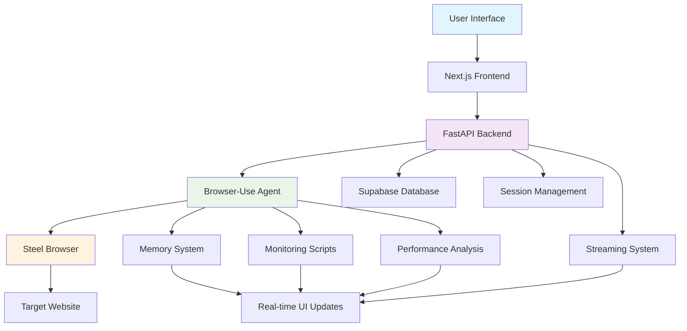

# Bugzer Browser - AI-Powered Web Testing Platform

[](https://github.com/your-org/bugzer_browser/actions)
[](https://opensource.org/licenses/MIT)
[](https://www.typescriptlang.org/)
[](https://www.python.org/)
[](https://nextjs.org/)
[](https://fastapi.tiangolo.com/)

Bugzer Browser is an advanced AI-powered web testing platform that combines autonomous browser automation with real-time monitoring and comprehensive reporting. Built with modern technologies and intelligent agent systems, it provides developers and QA teams with powerful tools to test web applications automatically.

## 🚀 Features

### 🤖 AI-Powered Automation
- **Autonomous Browser Control**: AI agents navigate websites like real users
- **Natural Language Testing**: Describe tests in plain English
- **Intelligent Decision Making**: AI adapts to unexpected scenarios
- **Context-Aware Actions**: Maintains understanding across complex user journeys

### 📊 Real-time Monitoring
- **Live Performance Tracking**: Monitor page load times, network requests, and resource usage
- **Error Detection**: Automatic identification of JavaScript errors, layout issues, and accessibility problems
- **Visual Analysis**: Screenshot capture and visual regression detection
- **Network Analysis**: Comprehensive network request monitoring and analysis

### 🔧 Advanced Browser Integration
- **Steel Browser Integration**: Remote browser automation with session management
- **Custom Monitoring Scripts**: JavaScript injection for deep page analysis
- **Multi-page Support**: Seamless navigation across complex web applications
- **Session Persistence**: Maintain context across browser sessions

### 📈 Comprehensive Reporting
- **Detailed Test Reports**: Complete analysis of test execution and results
- **Performance Metrics**: In-depth performance analysis and recommendations
- **Visual Reports**: Screenshots and visual evidence of test execution
- **Historical Tracking**: Track performance trends over time

### 🎯 User Experience
- **Real-time Updates**: Live streaming of test execution progress
- **Interactive Interface**: Modern, responsive UI built with Next.js
- **Tool Call Visualization**: See exactly what the AI agent is doing
- **Memory Management**: Transparent view of agent decision-making process

## 🏗️ Architecture



### Technology Stack

**Frontend:**
- Next.js 14 with App Router
- TypeScript for type safety
- Tailwind CSS for styling
- Vercel AI SDK for real-time communication
- Framer Motion for animations
- Radix UI for accessible components

**Backend:**
- FastAPI for high-performance API
- Python 3.11+ with async/await
- Browser-use for AI-powered automation
- Steel Browser for remote browser control
- Supabase for database and authentication

**Infrastructure:**
- Vercel for frontend deployment
- Render for backend hosting
- Supabase for database and auth
- GitHub Actions for CI/CD

## 📚 Documentation

Comprehensive documentation is available in the `DOCS/` directory:

- **[Browser-Use Integration](DOCS/01-browser-use-and-custom-functions.md)** - Detailed guide to browser automation and custom functions
- **[JavaScript Injection](DOCS/02-javascript-injection-and-information-extraction.md)** - How we extract information from web pages
- **[Memory Management](DOCS/03-memory-management-and-agent-architecture.md)** - Agent memory system and decision-making
- **[UI AI SDK Integration](DOCS/04-ui-ai-sdk-integration-and-real-time-updates.md)** - Real-time communication and updates
- **[System Architecture](DOCS/05-system-architecture-and-infrastructure.md)** - Overall system design and infrastructure
- **[Testing & DevOps](DOCS/06-testing-deployment-and-devops.md)** - Testing strategies and deployment processes

## 🚀 Quick Start

### Prerequisites

- Node.js 18+ and npm
- Python 3.11+
- Supabase account
- Steel Browser API key
- Anthropic API key (or other LLM provider)

### Installation

1. **Clone the repository**
   ```bash
   git clone https://github.com/your-org/bugzer_browser.git
   cd bugzer_browser
   ```

2. **Install frontend dependencies**
   ```bash
   npm install
   ```

3. **Install backend dependencies**
   ```bash
   pip install -r requirements.txt
   ```

4. **Set up environment variables**
   ```bash
   # Frontend (.env.local)
   NEXT_PUBLIC_SUPABASE_URL=your_supabase_url
   NEXT_PUBLIC_SUPABASE_ANON_KEY=your_supabase_anon_key
   NEXT_PUBLIC_API_URL=http://localhost:8000
   
   # Backend (.env)
   STEEL_API_KEY=your_steel_api_key
   STEEL_API_URL=your_steel_api_url
   ANTHROPIC_API_KEY=your_anthropic_api_key
   SUPABASE_SERVICE_ROLE_KEY=your_supabase_service_key
   ```

5. **Start the development servers**
   ```bash
   # Start both frontend and backend
   npm run dev
   
   # Or start individually
   npm run next-dev    # Frontend on :3000
   npm run fastapi-dev # Backend on :8000
   ```

6. **Open your browser**
   Navigate to `http://localhost:3000` to access the application.

## 🧪 Usage

### Creating a Test

1. **Sign up/Login** to your account
2. **Enter website URL** you want to test
3. **Describe the test** in natural language (e.g., "Test the checkout process")
4. **Submit** and watch the AI agent execute the test in real-time

### Example Test Scenarios

- **E-commerce**: "Test adding items to cart and completing checkout"
- **Authentication**: "Test user registration and login flow"
- **Forms**: "Test form validation and submission"
- **Navigation**: "Test all main navigation links and pages"
- **Performance**: "Test page load times and identify slow resources"

### Monitoring Test Execution

- **Real-time Progress**: Watch the AI agent navigate your website
- **Tool Calls**: See exactly what actions the agent is performing
- **Memory Updates**: Understand the agent's decision-making process
- **Performance Metrics**: Monitor network requests and page performance
- **Error Detection**: Automatic identification of issues

## 🔧 Configuration

### Agent Settings

```typescript
interface AgentSettings {
  steps: number;           // Maximum number of actions
  temperature: number;    // AI creativity level
  model: string;          // LLM model to use
  timeout: number;        // Test timeout in seconds
}
```

### Model Providers

Supported LLM providers:
- **Anthropic Claude** (recommended)
- **OpenAI GPT-4**
- **Google Gemini**
- **DeepSeek**

## 🧪 Testing

### Running Tests

```bash
# Frontend tests
npm run test

# Backend tests
pytest tests/

# End-to-end tests
npx playwright test

# All tests
npm run test:all
```

### Test Coverage

- **Unit Tests**: Component and function testing
- **Integration Tests**: API and service testing
- **E2E Tests**: Full user flow testing
- **Performance Tests**: Load and stress testing

## 🚀 Deployment

### Production Deployment

The application is deployed using:
- **Frontend**: Vercel (automatic deployments from main branch)
- **Backend**: Render (containerized Python application)
- **Database**: Supabase (managed PostgreSQL)

### Environment Setup

1. **Configure production environment variables**
2. **Set up CI/CD pipeline** with GitHub Actions
3. **Configure monitoring** and error tracking
4. **Set up backup strategies** for data protection

## 🤝 Contributing

We welcome contributions! Please see our [Contributing Guidelines](CONTRIBUTING.md) for details.

### Development Setup

1. Fork the repository
2. Create a feature branch
3. Make your changes
4. Add tests for new functionality
5. Submit a pull request

### Code Standards

- **TypeScript** for frontend code
- **Python** with type hints for backend
- **ESLint** and **Prettier** for code formatting
- **Pytest** for Python testing
- **Jest** and **Playwright** for frontend testing

## 📊 Performance

### Benchmarks

- **Test Execution**: 2-5 minutes average per test
- **Concurrent Users**: Supports 50+ simultaneous tests
- **Response Time**: <200ms API response time
- **Uptime**: 99.9% availability

### Optimization

- **Browser Session Reuse**: Efficient resource management
- **Streaming Updates**: Real-time communication
- **Caching**: Intelligent data caching
- **Load Balancing**: Horizontal scaling support

## 🔒 Security

### Security Features

- **Authentication**: Supabase Auth with JWT tokens
- **Authorization**: Role-based access control
- **Data Encryption**: All data encrypted in transit and at rest
- **Session Isolation**: Browser sessions isolated per user
- **Input Validation**: Comprehensive input sanitization

### Security Testing

- **SQL Injection Protection**: Comprehensive testing
- **XSS Prevention**: Input sanitization and validation
- **Rate Limiting**: API rate limiting and abuse prevention
- **Security Headers**: Proper security headers implementation

## 📈 Roadmap

### Upcoming Features

- **Multi-browser Support**: Chrome, Firefox, Safari testing
- **Mobile Testing**: iOS and Android device testing
- **Visual Regression Testing**: Automated visual comparison
- **API Testing**: REST and GraphQL API testing
- **Load Testing**: Performance and stress testing
- **Team Collaboration**: Multi-user testing environments

### Long-term Goals

- **Machine Learning**: Enhanced pattern recognition
- **Custom Test Scripts**: User-defined test automation
- **Integration Testing**: CI/CD pipeline integration
- **Advanced Analytics**: Detailed performance insights
- **Enterprise Features**: SSO, advanced reporting, compliance

## 📄 License

This project is licensed under the MIT License - see the [LICENSE](LICENSE) file for details.

## 🙏 Acknowledgments

- **Browser-use** for AI-powered browser automation
- **Steel Browser** for remote browser infrastructure
- **Vercel AI SDK** for real-time communication
- **Supabase** for backend infrastructure
- **Next.js** and **FastAPI** communities

## 📞 Support

- **Documentation**: Check the `DOCS/` directory
- **Issues**: Report bugs via GitHub Issues
- **Discussions**: Join our GitHub Discussions
- **Email**: support@bugzer.com

---

**Bugzer Browser** - Making web testing intelligent, automated, and accessible. 🚀